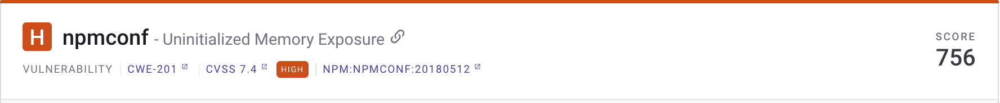
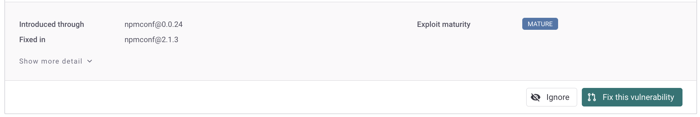
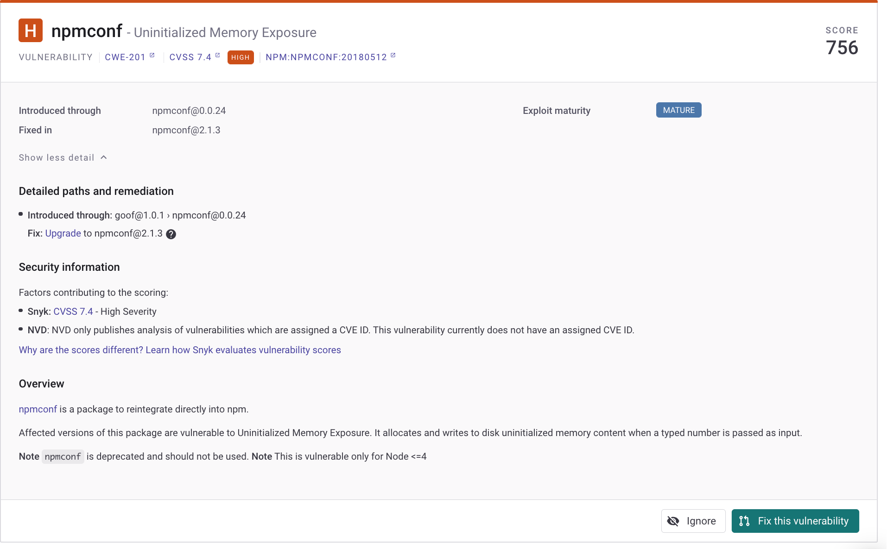

# 카드 정보 발급

문제 카드는 프로젝트의 세부 정보 페이지에 나타납니다. 다음과 같은 사용 가능한 옵션을 사용하여 다음을 수행할 수 있습니다.

* [문제 카드 정보 보기](issue-card-information.md#view-issue-card-information).
* [문제 카드 확장하여 자세한 정보 표시](issue-card-information.md#expand-an-issue-card-to-show-more-details).
* [문제 카드 필터링 및 정렬](issue-card-information.md#filter-and-sort-issue-cards).
* [추가 카드 작업 수행](issue-card-information.md#perform-additional-card-actions).

## 문제 카드 정보 보기

문제 카드는 특정 취약성이나 라이선스 문제에 대한 세부 정보 및 취할 수 있는 조치를 보여줍니다.

<figure><figcaption>
npmconf 취약성에 대한 문제 카드
</figcaption></figure>

문제 카드에는 이 문서의 다음 섹션에서 설명하는 정보가 포함된 [헤더 섹션](issue-card-information.md#header-section)과 [바디 섹션](issue-card-information.md#body-section)이 제공됩니다.

### 헤더 섹션

<figure><figcaption>
npmconf 문제 카드 헤더
</figcaption></figure>

* [심각도 수준](../../manage-risk/prioritize-issues-for-fixing/severity-levels.md): 예를 들어 **높음**
* 문제 이름: 예를 들어 **미초기화된 메모리 노출**, 링크 복사 가능
* **점수**: [우선 순위 점수](../../manage-risk/prioritize-issues-for-fixing/priority-score.md): 0에서 1,000까지
* 유형: **취약성** 또는 **라이선스 문제**
* [CWE](https://cwe.mitre.org/index.html)(Common Weakness Enumeration), [CVSS](https://www.first.org/cvss/calculator/3.1)(Common Vulnerability Scoring System) 및 [Snyk 취약성 데이터베이스](https://snyk.io/vuln)에 대한 문제 정보로의 링크. 이 링크를 사용하여 CWE, CVE 및 CVSS 점수에 대한 자세한 정보를 볼 수도 있고, 특정 취약성의 문제 카드에서 Snyk 취약성 데이터베이스 정보로 이동할 수도 있습니다.

### 바디 섹션

<figure><figcaption>
npmconf 문제 카드 바디 세부 사항
</figcaption></figure>

* **소개 위치**: 취약성이나 라이선스가 도입된 경로
* **수정 위치**: 취약성이 수정된 파일
* [**악용 성숙도**](../../manage-risk/prioritize-issues-for-fixing/view-exploits.md): 예를 들어 **성숙** 또는 **컨셉 증명**
* **도달성**: 예를 들어 **도달 가능**. 자세한 정보 및 예제는 다음을 참조하세요: [도달 가능한 취약성](../../manage-risk/prioritize-issues-for-fixing/reachability-analysis.md)
* **소셜 트렌드**: Snyk은 X(이전에는 Twitter로 알려짐)에서 활발히 논의되고 있는 문제에 대한 [트렌드](../../manage-risk/prioritize-issues-for-fixing/vulnerabilities-with-social-trends.md) 배너를 표시합니다.

## 문제 카드 확장하여 자세한 정보 표시

문제 카드를 확장하여 자세한 정보를 표시하면 다음과 같은 취약성에 대한 세부 정보를 볼 수 있습니다:

* 자세한 경로 정보
* 수정 권고 사항
* 취약성 개요
* 취약성 내에서 취약한 함수

<figure><figcaption>
npmconf 취약성에 대한 세부 정보
</figcaption></figure>

## 문제 카드 필터링 및 정렬

프로젝트에 여러 필터를 적용하여 특정 기준을 충족하는 문제 집합을 표시할 수 있습니다:

* 취약성 또는 라이선스 문제
* 특정 심각도의 문제
* 우선 순위 점수 범위 내의 문제
* 악용이 있고 해당 악용이 얼마나 성숙한지
* 오픈되어 있는 문제 또는 패치되었거나 무시된 문제

프로젝트의 문제 카드를 우선 순위 점수나 심각도에 따라 정렬할 수 있습니다.

## 추가 카드 작업 수행

다음 작업을 문제 카드에서 수행할 수 있습니다:

* [문제 무시](../../manage-risk/prioritize-issues-for-fixing/ignore-issues/): 조치를 취할 필요가 없거나 보고서에 나타낼 필요가 없는 문제의 경우 무시할 수 있습니다.
* [Jira 티켓 생성](../../integrate-with-snyk/jira-and-slack-integrations/jira-integration.md): Jira 통합이 있으면 Snyk와 연결하여 프로젝트 세부 정보 페이지에서 직접 Jira 티켓을 생성하여 취약성을 수정할 수 있습니다.
* [취약성 수정](../../scan-with-snyk/snyk-open-source/manage-vulnerabilities/fix-your-vulnerabilities.md): 수정 사항이 있는 경우 개별 취약성을 수정할 수 있습니다.
