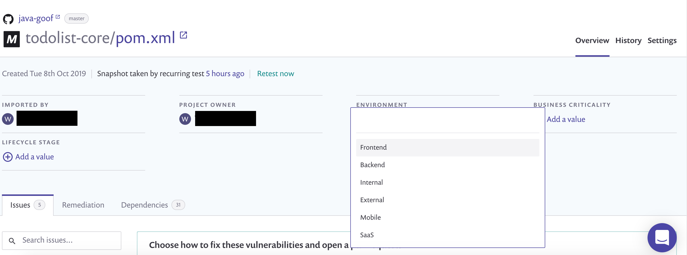
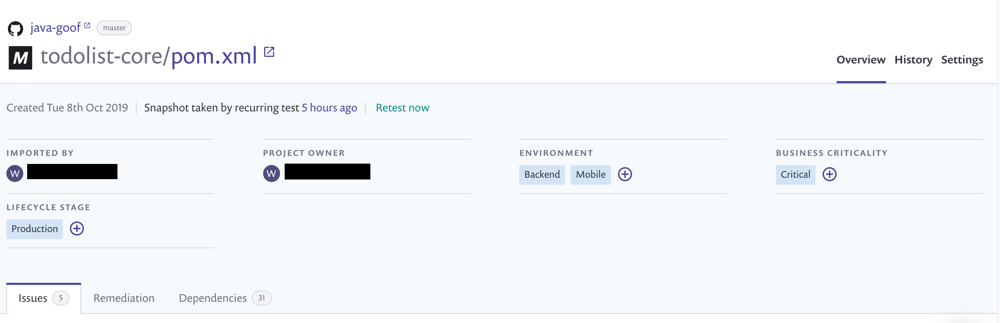
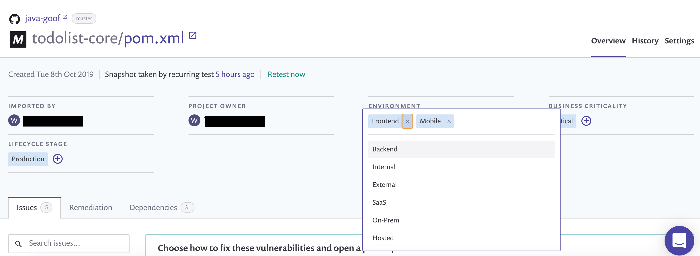
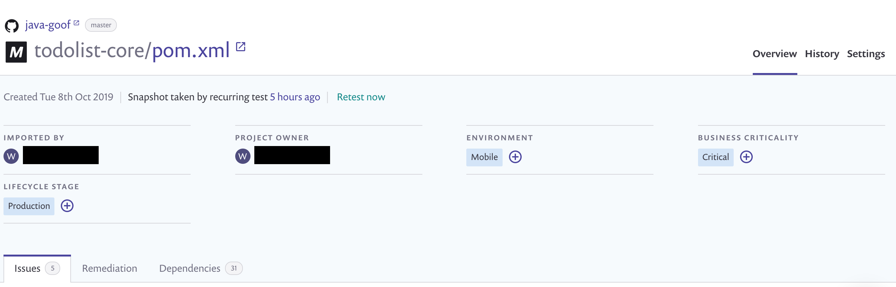

# 프로젝트 속성

프로젝트 속성은 사전 정의된 값 목록에서 선택하여 프로젝트에 속성 값을 적용할 수 있는 정적이고 변경할 수 없는 필드입니다. 속성을 적용한 후 필요에 따라 프로젝트에서 제거할 수 있습니다.

그룹화, 우선 순위 지정, 프로젝트 필터링에 속성을 사용하세요. 수명주기 단계, 비즈니스 중요도, 환경과 같은 속성을 사용하여 세분화된 수준에서 문제를 우선 순위로 지정할 수 있습니다. Snyk [정책](../../manage-risk/policies/)에 속성을 적용한 후 해당 속성 적용된 프로젝트에 정책을 할당할 수 있습니다.

## **사용 가능한 속성 및 그 값들**

**프로젝트** 목록에서 **그룹화 없음**을 사용하여 최적의 프로젝트 가시성을 확보하고 프로젝트 수준에서 [태그](../introduction-to-snyk-projects/project-tags.md) 및 필터 속성을 적용하세요.

<figure><figcaption>
프로젝트 레벨 필터링 속성
</figcaption></figure>

다음 표에 사용 가능한 프로젝트 속성이 요약되어 있습니다.

| 속성                                                                                                                                                                                                                                                                                                                   | 속성 옵션                                                                                                                                                    |
| ----------------------------------------------------------------------------------------------------------------------------------------------------------------------------------------------------------------------------------------------------------------------------------------------------------------------- | ----------------------------------------------------------------------------------------------------------------------------------------------------------- |
| 
비즈니스 중요도 위험 점수 활성화 시, 비즈니스 중요도 속성은 자동으로 최고 속성 수준에 따라 점수에 영향을 미칩니다. 관련 정보는 <a href="../../manage-risk/prioritize-issues-for-fixing/risk-score.md#business-criticality">위험 점수</a> 문서에서 확인하세요.  
 | <ul><li>중대함</li><li>높음</li><li>중간</li><li>낮음</li></ul>                                                                                          |
| 환경                                                                                                                                                                                                                                                                                                                 | <ul><li>프런트엔드</li><li>백엔드</li><li>내부</li><li>외부</li><li>모바일</li><li>SaaS</li><li>온프렘</li><li>호스팅</li><li>분산</li></ul> |
| 수명주기 단계                                                                                                                                                                                                                                                                                                         | <ul><li>운영</li><li>개발</li><li>실험</li></ul>                                                                                            |


프로젝트에 속성을 적용하고 제거하기 위해 [속성 적용](../../snyk-api/reference/projects-v1.md#org-orgid-project-projectid-attributes) 엔드포인트를 사용할 수 있습니다.

또한 Snyk CLI 옵션 `--project-business-criticality`, `--project-environment`, `-`-project-lifecycle`을 사용하여 속성을 적용하고 제거할 수 있습니다. 이러한 옵션을 지원하는 명령어에 대해서는 [CLI 명령어 및 옵션 요약](../../snyk-cli/cli-commands-and-options-summary.md)을 참고하세요.



**프로젝트 속성 편집** 권한이 있는 역할은 프로젝트에 속성을 추가할 수 있습니다.


## **프로젝트에 속성 값 적용**

1. 프로젝트 세부 페이지에서 프로젝트에 적용할 속성 아래의 **+** 아이콘을 클릭합니다.
2. 목록에서 값을 선택합니다.

<figure><figcaption>
프로젝트에 적용할 속성 값 선택
</figcaption></figure>

속성에 값을 선택한 후, 해당 값이 프로젝트 세부 페이지에 나타납니다. 하나의 속성에 대해 여러 값 및 여러 속성을 프로젝트에 적용할 수 있습니다.

<figure><figcaption>
적용된 속성 값이 표시된 프로젝트 세부 페이지
</figcaption></figure>

## **속성 값 제거**

1. 프로젝트에서 제거하려는 적용된 값을 가진 속성을 선택합니다.
2. 제거하려는 값을 가진 **x** 아이콘을 클릭합니다.

<figure><figcaption>
프런트엔드 속성 값 제거
</figcaption></figure>

속성 값이 프로젝트에서 제거됩니다.

<figure><figcaption>
모바일 속성 값만 표시된 프로젝트 세부 페이지
</figcaption></figure>

## **프로젝트 목록 페이지에서 속성 값으로 필터링**

**프로젝트** 목록 페이지 왼쪽에 그룹화 없음(ungrouped)으로 설정되어있을 때, 프로젝트를 필터링하려는 속성의 값을 선택하세요.

하나의 속성에서 여러 값으로 필터링하면 Snyk는 필터에 적용된 하나 이상의 값과 관련된 프로젝트 목록을 반환합니다.

여러 속성으로 필터링하면 Snyk는 다수의 속성의 값이 적용된 프로젝트 목록을 반환합니다.