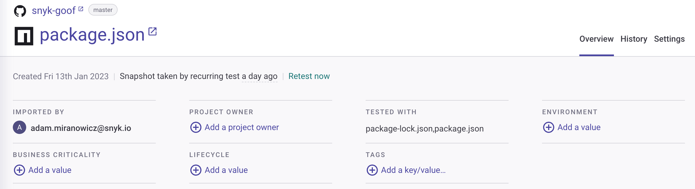

# 프로젝트 정보

**프로젝트** 페이지는 가져온 프로젝트 및 프로젝트에 대한 취약점 및 라이선스 문제와 같은 정보를 나열합니다. 이 페이지에서는 프로젝트를 그룹화, 필터링, 정렬하고 활성화, 비활성화, 테스트 빈도 변경 또는 삭제할 수 있습니다.

## 기존 프로젝트 필터링

**프로젝트** 페이지에서는 이슈를 포함하거나 포함하지 않는지 및 Git 통합 유형에 따라 프로젝트를 필터링할 수 있습니다. 다음 필터를 사용할 수 있습니다:

* **표시**:
  * **이슈가 있는 것** - 이슈가 있는 프로젝트만 표시합니다.
  * **이슈가 없는 것** - 이슈가 없는 프로젝트만 표시합니다.
* **통합** - Snyk에 가져온 통합된 Git 저장소를 표시합니다.

모든 필터 기준을 재설정하려면 **재설정**을 클릭하세요.

<figure><figcaption>
프로젝트 페이지의 필터 창
</figcaption></figure>


기본적으로 이슈를 발견한 활성 프로젝트만 프로젝트 페이지에 표시됩니다.


## 프로젝트 세부 정보 보기

프로젝트에 대한 자세한 정보를 보려면 프로젝트 항목을 클릭하세요. 열리는 페이지에는 상세한 프로젝트 정보가 표시됩니다.

<figure><figcaption>
<strong><code>package.json</code></strong> 프로젝트에 대한 자세한 정보
</figcaption></figure>

다음 정보를 제공합니다:

* **헤더**: 프로젝트의 요약을 표시합니다. [프로젝트 요약](project-information.md#view-project-summary) 참조.
* **이슈 카드**: 발견된 이슈의 요약을 표시합니다. [이슈 카드 정보](issue-card-information.md) 참조.
* **보기** (오른쪽 상단의 링크):
  * **개요**: [프로젝트 이슈, 수정, 및 종속성](view-project-issues-fixes-and-dependencies.md) 표시.
  * **이력**: 최근 테스트의 이력 스냅숏을 표시합니다. [프로젝트 이력 뷰](view-project-history.md) 참조.
  * **설정**: [프로젝트 설정](view-and-edit-project-settings.md) 표시.

## 프로젝트 요약 보기

<figure><figcaption>
<code>package.json</code> 프로젝트에 대한 프로젝트 요약
</figcaption></figure>

각 프로젝트 개요의 헤더에서 다음 정보를 볼 수 있습니다:

* 파일 및 이력 정보
  * 모니터링 중인 저장소의 이름 및 외부 링크
  * 모니터링 중인 브랜치의 이름
  * SCM에서 프로젝트 파일로의 직접 링크
  * Snyk에 프로젝트가 처음 가져와진 시간
  * Snyk가 최종 스냅숏을 촬영하고 테스트했던 SCM에서 가져온 파일의 시간
* 프로젝트 가져오기
  * **가져온 사용자**: 프로젝트를 가져온 사용자입니다.
  * **프로젝트 소유자**: **프로젝트 소유자 추가**를 클릭하여 프로젝트에 액세스 권한이있는 사용자 목록에서 소유자를 추가할 수 있습니다. 또한 [주어진 Org ID와 관련된 조직의 모든 프로젝트 목록](../../snyk-api/reference/projects.md#orgs-org_id-projects)을 통해이 정보를 볼 수도 있습니다.
* 미리 정의된 [프로젝트 특성](project-attributes.md) 및 추가 프로젝트 태그 메타데이터가 있습니다.