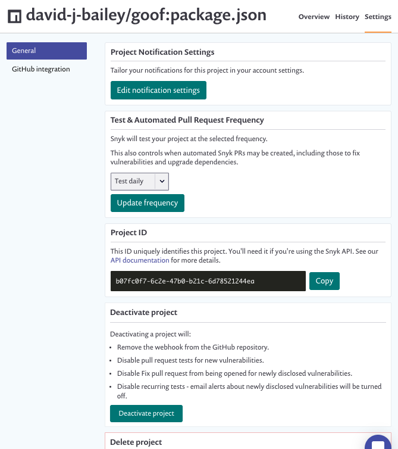

# 프로젝트 설정 보기 및 편집하기

프로젝트 목록 또는 세부 페이지에서 **설정** 탭을 선택하여 프로젝트 설정을 보고 편집할 수 있습니다:

<figure><figcaption>
프로젝트 설정
</figcaption></figure>

**GitHub 통합**을 클릭하여 SCM 특정 설정을 편집할 수 있습니다. 이는 다른 SCMs에도 적용됩니다.

**프로젝트 알림 설정**을 편집하고 **테스트 및 자동화된 풀 리퀘스트 빈도**를 업데이트할 수 있습니다. 또한 Snyk API 호출에 사용할 **프로젝트 ID**를 검색할 수 있습니다.


기본 테스트 빈도 및 사용 가능한 테스트 빈도는 프로젝트 유형에 따라 다르며 오픈 소스, 코드 분석, 컨테이너 또는 IaC에 따라 다릅니다. 자세한 내용은 Snyk 프로젝트 페이지의 [테스트 빈도 설정](./#test-frequency-settings)을 참조하세요. 또한 API 엔드포인트 [프로젝트 ID로 프로젝트 업데이트](../../snyk-api/reference/projects.md#orgs-org_id-projects-project_id)를 사용하여 테스트 빈도를 설정할 수도 있습니다.


프로젝트를 비활성화하려면 프로젝트 설정 페이지에서 **프로젝트 비활성화**를 선택하세요. 프로젝트를 비활성화함으로써 다음과 같은 작업이 수행됩니다:

- SCM 리포지토리에서 웹훅 제거
- 새 취약점에 대한 풀 리퀘스트 테스트 비활성화
- 새로 공개된 취약점에 대한 수정 풀 리퀘스트가 열리는 것을 비활성화
- 주기적인 테스트 비활성화; 새로 공개된 취약점에 대한 이메일 알림이 중지됨
- 프로젝트의 모든 취약성을 보고서 및 대시보드 뷰에서 제거

프로젝트를 삭제하려면 프로젝트 설정 페이지에서 **프로젝트 삭제**를 선택하세요. 프로젝트를 삭제함으로써 다음과 같은 작업이 수행됩니다:

- Snyk에서 프로젝트 및 모든 기록된 스냅샷 데이터 삭제
- SCM 리포지토리에서 웹훅 제거