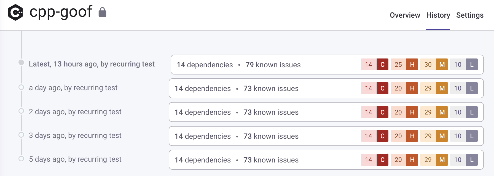
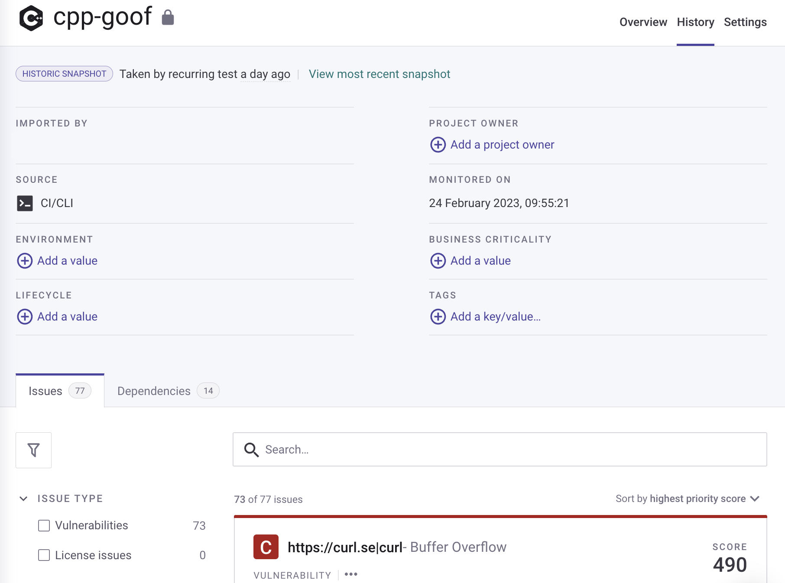

# 프로젝트 히스토리 보기

프로젝트 세부 정보 페이지의 **히스토리** 탭을 선택하여 이전 스캔 결과를 확인할 수 있습니다. 일반적인 경우에 Snyk은 최소 두 개의 스냅샷을 유지합니다. 즉, 이전 스냅샷과 가장 최근 스캔의 현재 스냅샷입니다. 발견된 문제가 스캔 간에 변경되지 않았을 때는 더 많은 항목이 표시될 수 있지만 목록의 항목들은 동일한 스냅샷을 가리킵니다. 24시간 이내에 다수의 스캔이 실행되면, 이후 리스트에서 삭제됩니다.

<figure><figcaption>
프로젝트 세부 정보 페이지 히스토리 탭
</figcaption></figure>

특정 항목을 클릭하여 해당 기간의 프로젝트 세부 정보 페이지(스냅샷)를 확인할 수 있습니다.

<figure><figcaption>
히스토리의 특정 기간에 대한 프로젝트 세부 정보 페이지
</figcaption></figure>