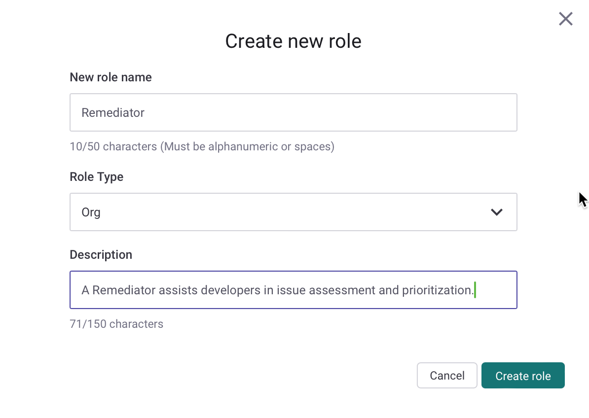
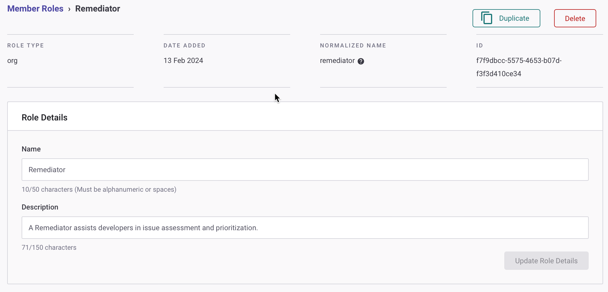
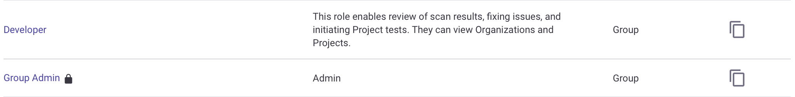
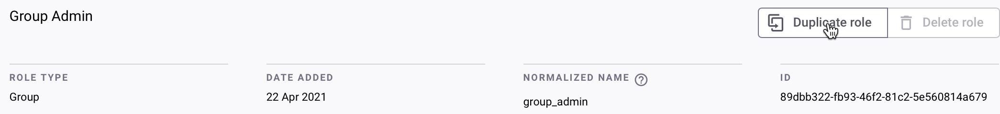
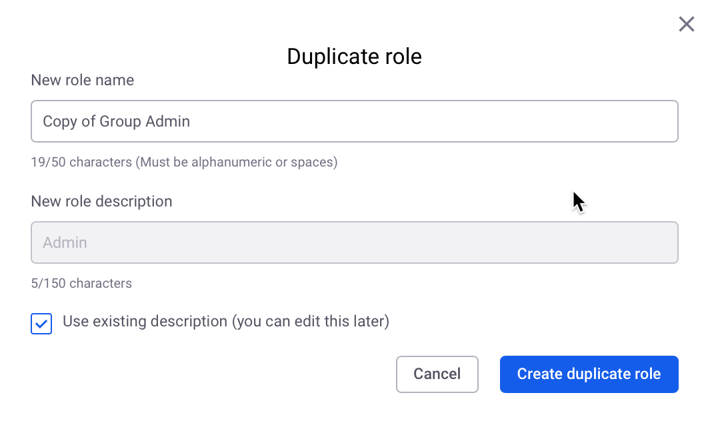

# 사용자 역할 관리


**기능 이용 가능 여부**

사용자 역할 관리는 엔터프라이즈 플랜에서만 사용할 수 있습니다. 자세한 정보는 [요금제 및 가격 책정](https://snyk.io/plans/)을 참조하십시오.


Snyk의 **롤 관리** 기능을 통해 미리 정의된 및 사용자 및 기관에 반영된 역할에 대한 권한 세트를 만들고 강제할 수 있어 사용자 및 기관의 기능을 반영하는 권한 집합을 만들 수 있습니다.

**롤 관리**에서 다음을 수행할 수 있습니다:

1. [커스텀 역할 생성](user-role-management.md#커스텀-역할-생성)
2. [커스텀 역할 편집](user-role-management.md#커스텀-역할-편집)
3. [미리 정의된 또는 커스텀 역할 복제](user-role-management.md#미리-정의된-또는-커스텀-역할-복제)
4. [커스텀 역할 삭제](user-role-management.md#커스텀-역할-삭제)
5. [사용자에게 역할 할당](user-role-management.md#사용자에게-역할-할당)
6. [서비스 계정에 역할 할당](user-role-management.md#서비스-계정에-역할-할당)
7. [사용자의 역할 변경](user-role-management.md#사용자의-역할-변경)
8. [커스텀 SSO에서 역할 사용](user-role-management.md#커스텀-sso에서-역할-사용)

더 많은 정보는 [API를 사용한 사용자 관리](../user-management-with-the-api/)에서 확인할 수 있습니다.

## 멤버 역할 작업에 필수적인 정보

* **멤버 역할** 기능을 사용하여 사용자에게 부여된 권한은 모든 Snyk 환경에서 동일한 기능을 제공합니다: 웹 UI, API, CLI 및 IDE.
* 모든 기관 수준 멤버 역할에 대해 기본적으로 **기관 보기** 권한이 필요합니다.
* 기관의 프로젝트 관련 데이터를 보려면 기관 보기, 프로젝트 보기 및 프로젝트 기록 보기 권한이 해당 역할에 최소한 추가해야 합니다.
* [통합 편집 능력](custom-role-templates/integration-editor-implementor-role-template.md)을 위해서는 **기관 편집** 권한이 필요합니다.
* Snyk은 역할 권한이 승격되지 않도록 막습니다. 이는 사용자가 다른 사용자에게 더 높은 권한을 할당하거나 더 높은 권한의 서비스 계정을 생성할 수 없음을 의미합니다.
* 권한에 불확실한 경우 권한을 처음부터 만들지 말고 기존 표준 역할을 복제하고 권한을 수정하는 **역할 복제** 기능을 사용하는 것이 좋습니다.

## 역할 관리

커스텀 역할을 생성, 편집, 복제 및 삭제하여 사용자가 Snyk 플랫폼 전체에서 수행할 필요가 있는 정확한 권한을 부여할 수 있습니다. 이를 통해 올바른 사람이 올바른 자원에 올바른 권한으로 액세스할 수 있도록 하여 투명도를 극대화하고 리스크를 감소시킵니다.

**그룹** 아래에 있는 **기관 관리자** 및 **기관 협업자**와 같은 [미리 정의된 역할](pre-defined-roles.md)을 찾을 수 있습니다. 이러한 역할은 관련 권한을 볼 수 있지만 권한을 추가, 편집, 또는 삭제할 수 없습니다. 미리 정의된 역할 권한은 사용자 정의 역할 생성의 출발점으로 복제될 수 있습니다.

## 커스텀 역할 생성

그룹의 롤 관리는 **설정** > **멤버 역할**에서 이루어집니다. 이는 **그룹 관리자** 또는 **롤 관리** 권한이 있는 사용자가 접근할 수 있습니다.

**새 역할 생성** 버튼을 클릭하고 **새 역할 이름**, **역할 유형**, 및 **설명**을 입력합니다. 역할 이름은 사용자의 목적을 반영하고 영숫자 문자 및 공백을 포함할 수 있는 고유해야 하며 **역할 유형**은 사용자가 가질 수 있는 권한 세트를 반영합니다. 기관 수준 또는 그룹 및 기관 수준 권한 세트입니다.

<figure><figcaption>
커스텀 기관 수준 역할 생성
</figcaption></figure>

계속하려면 **역할 생성** 버튼을 클릭할 수 있습니다. 역할에 대한 기본 세부 정보는 **역할 세부정보** 화면의 상단 섹션에서 볼 수 있습니다.

<figure><figcaption>
커스텀 역할에 대한 역할 세부정보
</figcaption></figure>

하단 섹션에서는 선택한 **역할 유형**과 일치하는 수준에서 사용 가능한 모든 권한이 나열됩니다. 사용 가능한 권한에 대한 자세한 정보는 [미리 정의된 역할](pre-defined-roles.md)을 참조하십시오.


Snyk은 사용자에게 자신보다 높은 권한의 역할을 할당하거나 더 높은 권한의 서비스 계정을 생성하지 못하게 합니다. 사용자가 권한을 확실하게 모르는 경우 권한을 처음부터 구축하는 대신 **역할 복제** 기능을 사용하여 기존 표준 역할을 복제한 다음 권한을 수정하는 것이 좋습니다.


필요한 권한을 선택하고 하단의 업데이트 버튼을 클릭합니다. 그룹 수준 역할은 기관 및 그룹 수준 권한을 모두 가지며 각 권한 세트는 별도로 업데이트됩니다.

해당 권한 섹션의 하단에서 **모두 활성화** 또는 **모두 비활성화** 버튼을 사용하여 세트 내의 모든 권한을 빠르게 활성화 또는 비활성화할 수 있습니다. 각 섹션의 하단에서 버튼을 사용하여 권한을 업데이트해야 합니다.

<figure><figcaption>
기관 수준 권한 섹션
</figcaption></figure>

권한은 카테고리로 그룹화됩니다. 이는 권한 할당이 어떤 기능을 활성화시키는지 이해하기 쉽게 하기 위해 그리고 일부 권한은 완전히 기능을 활용하기 위해 비슷한 권한을 요구하기 때문에 이루어집니다. 예를 들어, 사용자가 기관에서 프로젝트를 이동하려면 (**프로젝트 이동** 권한) 해당 기관에 프로젝트을 추가할 수 있어야 하므로 (**프로젝트 추가** 권한) 이러한 권한은 연계하여 작동합니다.

역할 생성 프로세스가 완료되면 확인 메시지가 표시됩니다.

<figure><figcaption>
역할 업데이트 확인 메시지
</figcaption></figure>

### 커스텀 역할 편집

**그룹 관리자**는 **멤버 역할** 페이지의 목록에서 커스텀 역할을 선택하고 언제든지 이름, 설명 및 권한을 업데이트할 수 있습니다. 미리 정의된 역할이 설정된 방식 및 해당 역할을 복제할 수는 있지만 편집할 수는 없습니다.

하단의 목록에서 권한을 선택하고 **역할 권한 업데이트**를 클릭합니다.

역할 업데이트 프로세스가 완료되면 확인 메시지가 표시됩니다.

### 미리 정의된 또는 커스텀 역할 복제

**그룹 관리자**는 복제 역할 기능을 사용하여 기존 역할의 사본을 생성할 수 있습니다. 시스템은 역할에 연결된 권한만 복사하며 역할 멤버십은 복사되지 않습니다.

역할을 복사하려면 **멤버 역할** 목록의 각 역할 옆에 있는 **복제** 버튼을 사용하거나 멤버 역할 목록 페이지에서 역할을 선택하고 역할 세부정보 페이지를 열어 **역할 복제** 버튼을 클릭합니다.

<figure><figcaption>
멤버 역할 페이지에서 복제 아이콘을 사용하여 역할 복제
</figcaption></figure>

<figure><figcaption>
역할 세부정보 아래의 '역할 복제' 버튼을 클릭하여 역할 복제
</figcaption></figure>

고유한 이름과 설명을 입력하도록 요청하는 **복제 역할** 팝업이 나타납니다. 이전에 복사한 역할의 설명을 사용할 옵션을 선택할 수 있지만 이후에 편집할 수 있습니다. 생성을 진행하려면 **역할 복제** 버튼을 클릭합니다. **그룹 관리자** 또는 **롤 관리** 권한이 있는 커스텀 역할은 이 역할을 편집하여 새 권한을 할당하거나 이미 할당된 권한을 제거할 수 있습니다.

<figure><figcaption>
역할 복제 생성
</figcaption></figure>

### 커스텀 역할 삭제

그룹 관리자는 더 이상 필요하지 않은 커스텀 역할을 삭제할 수 있습니다. **멤버 역할** 목록에서 해당 역할을 열고 **역할 삭제** 버튼을 클릭하면 됩니다.

해당 역할이 하나 이상의 사용자 및 서비스 계정에 할당된 경우, 해당 사용자에게 현재 역할을 삭제하기 위해 다른 역할을 선택해야 합니다. 이 제한은 그룹 관리자가 실수로 역할을 삭제하고 사용자들을 Snyk에 접근 권한 없이 남겨 놓는 것을 방지합니다.

현재 역할이 삭제되면 해당하는 모든 사용자, 서비스 계정을 새로 선택한 새 역할에 재할당합니다.

미리 정의된 역할은 그룹에서 삭제할 수 없습니다.

<figure><figcaption>
역할 삭제 및 재할당 메시지
</figcaption></figure>

## 역할 할당

### 사용자에게 역할 할당


사용자에게 할당된 역할을 업데이트하려면 API를 사용할 수 있습니다. 자세한 내용은 [조직 내 사용자 역할 업데이트](../../snyk-api/reference/organizations-v1.md#org-orgid-members-update-userid) 엔드포인트를 참조하십시오.


**롤 관리** 권한을 가진 사용자는 그룹 내 모든 기관에 대해 사용자에게 역할을 할당할 수 있습니다.

기관을 선택하고 **멤버** 옵션을 선택합니다.

그룹 관리자를 제외한 모든 멤버 이름에 대해 현재 역할 옆의 드롭다운을 선택하고 해당 역할을 할당할 수 있습니다.

<figure><figcaption>
멤버 역할 선택
</figcaption></figure>

\
할당된 역할을 가진 새 멤버를 조직으로 초대할 수 있습니다.

**멤버 추가** > **새 멤버 초대**를 클릭하고 **새 멤버 가입 방식** 드롭다운에서 할당할 역할을 선택합니다.

<figure><figcaption>
할당된 역할을 가진 새 멤버 초대
</figcaption></figure>

**멤버 추가** 버튼을 클릭하고 **기존 멤버 추가**를 클릭하여 현재 그룹 멤버를 기관별 역할로 승격시킵니다.

Snyk은 사용자에게 자신보다 더 높은 권한을 가진 역할을 할당
