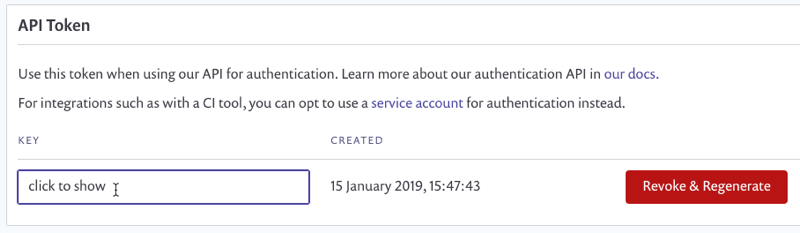

# Snyk 웹훅 설정

[Snyk API v1](https://snyk.docs.apiary.io/#reference/webhooks/webhook-collection/create-a-webhook)을 사용하여 내장 콘솔을 포함하여 Snyk 웹훅을 설정합니다.

Snyk 웹훅을 설정하려면 다음 단계를 따르세요:

1. Snyk 웹 UI의 **Organization** 설정에서 **Organization ID**를 복사합니다.

    <figure><figcaption>
Snyk 웹 UI에서 Organization ID 복사
</figcaption></figure>
    
2. Snyk 웹 UI에서 Organization admin **API Token**을 Service Account 또는 본인 계정에서 얻습니다.

    <figure><figcaption>
Snyk 웹 UI에서 API Token 가져오기
</figcaption></figure>
    
3. Snyk API v1에서 **Console**로 전환하고 조직 ID를 매개변수로 추가합니다.

    <figure><figcaption>
Snyk API v1에 orgId 추가하여 webhook 생성 요청을 POST
</figcaption></figure>
    
4. 헤더 섹션에 Snyk API 키를 **Authorization**에 추가합니다.

    <figure><figcaption>
Snyk API v1에 API 키를 Authorization에 추가
</figcaption></figure>
    
5. 본문 섹션에 값을 추가합니다\
    `{`\
    `“url”: “당신의 공개 URL 값”,`\
    `“secret”: “당신의 람다 시크릿 환경 변수 값”`\
    `}`

    <figure><figcaption>
Snyk API v1 POST 본문
</figcaption></figure>
    
6. **Call Resource**를 클릭합니다.

이 요청을 완료하면 Snyk에서 Slack으로의 연결이 완료됩니다. 새로운 취약점이 발생할 때마다 알림을 받게 됩니다.