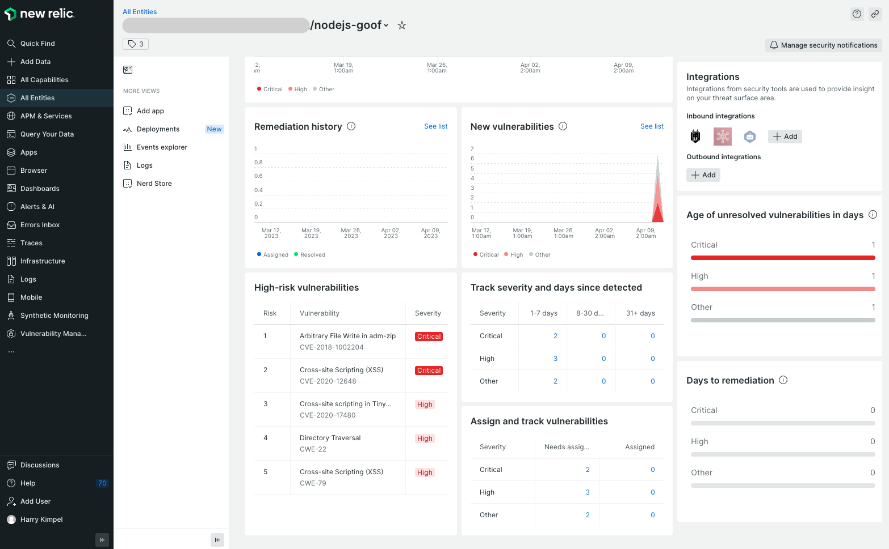
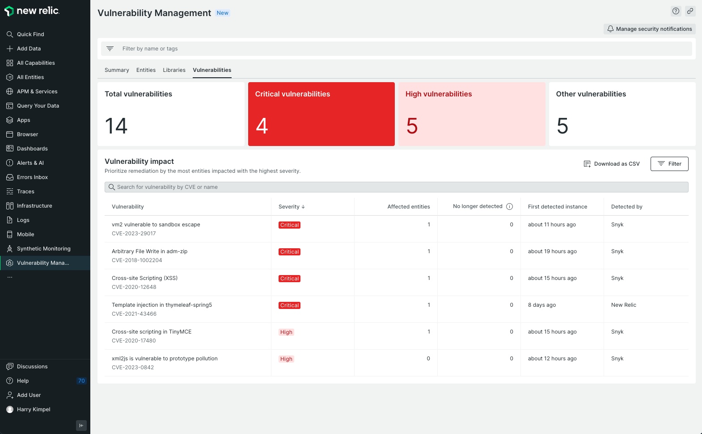

# Snyk Webhooks를 사용하여 New Relic을 Snyk와 통합하는 방법

New Relic Security API는 New Relic이 보안과 관련된 모든 유형의 정보를 New Relic 플랫폼으로 전송할 수 있는 최신 접근 방식입니다. 이 API는 New Relic의 취약성 관리 기능의 일부입니다.

New Relic Security API를 사용하는 것은 유익합니다. 왜냐하면 New Relic은 Data의 타입을 이해하고 정보를위한 사용자 정의 인터페이스를 제공할 수 있기 때문입니다. New Relic은 또한 이 정보를 New Relic이 소비할 수 있는 다른 유형의 데이터와 상호 연관시킬 수 있는 표준화된 방법을 제공합니다. New Relic의 탭에서 이러한 상관 관계를 볼 수 있으며, 엔터티의 취약성 관리 섹션을 포함합니다.

<figure><figcaption>
엔터티 수준의 취약점 관리
</figcaption></figure>

이러한 상관 관계의 예는 다음과 같습니다:

- New Relic APM (응용 프로그램 성능 모니터링)에서 모니터링되는 응용 프로그램의 경우, Snyk 웹훅은 응용 프로그램이 위치한 리포지토리를 제공합니다. New Relic은 그런 다음에 Snyk이 식별한 문제를 응용 프로그램 보안 관점에서 APM 데이터와 상관시킬 수 있습니다.
- New Relic이 실행 시간 동작에 대해 모든 것을 알고 있는 Kubernetes 클러스터 내에서 실행 중인 컨테이너의 경우, Snyk 웹훅은 ImageID를 제공합니다. New Relic은 그런 다음 컨테이너에 대한 보안 측면에 대해 제공된 자세한 정보를 상관시킬 수 있습니다.

New Relic은 또한 보안 관련 문제에 대한 전용 취약성 관리 섹션을 제공합니다. Snyk 웹훅을 통해 공유된 정보는 이 섹션에 자동으로 자동으로 채워집니다.

<figure><figcaption>
취약성 관리
</figcaption></figure>

Snyk와 New Relic 간의 통합을 설정하려면, 이 페이지의 단계를 따르세요. 이를 달성하는 두 가지 방법이 있습니다:

1. New Relic의 기본 보안 수용 프로세서를 통해: [New Relic 문서](https://docs.newrelic.com/docs/vulnerability-management/integrations/snyk/)의 안내에 따라 시작하십시오.
2. Azure Function App으로 작동하는 프록시로: [Azure Function App 생성](create-an-azure-function-app.md)로 시작합니다.

Snyk 웹훅을 설정하거나 사용하는 데 **문제가** 발생하면 **문의** 하여 솔루션 엔지니어 또는 기술 성공 매니저에게 도움을 요청하십시오.