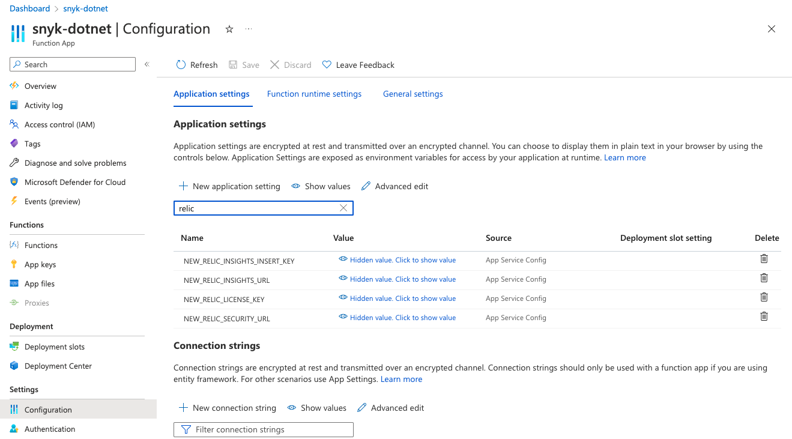

# Azure Function 환경 변수 구성

Azure Function 환경 변수 구성에 대한 자세한 내용은 Microsoft Azure Functions 문서 기사 [함수 앱 관리](https://learn.microsoft.com/en-us/azure/azure-functions/functions-how-to-use-azure-function-app-settings?tabs=portal)를 참조하십시오.

Azure Function 앱 구성으로 이동하여 다음 새 응용 프로그램 설정을 추가하십시오:

- **NEW\_RELIC\_SECURITY\_URL**: New Relic Security API의 URL입니다. 즉, https://security-api.newrelic.com/security/v1
- **NEW\_RELIC\_LICENSE\_KEY**: New Relic 라이선스 키

Snyk 계정에서 Azure DevOps Repos를 사용 중이라면 다음 응용 프로그램 설정도 구성할 수 있습니다:

- **AZURE\_DEVOPS\_ORG**: Azure DevOps 조직명

문제 해결을 위한 선택적 매개변수를 사용하여 별도의 New Relic 이벤트로 구성하려면 다음 응용 프로그램 설정을 구성하십시오:

- **NEW\_RELIC\_INSIGHTS\_URL**: New Relic 계정 이벤트 API의 URL입니다. 즉, https://insights-collector.newrelic.com/v1/accounts/{NR-ACCOUNT-ID}/events

<figure><figcaption>
Azure Function Configuration
</figcaption></figure>

다음으로 [Azure Function URL 복사](copy-the-azure-function-url.md).