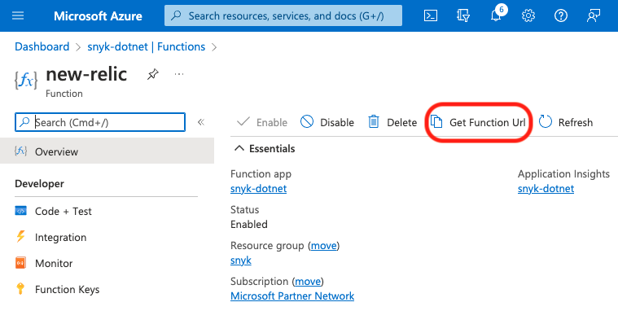

# Azure Function URL 복사

적절한 Azure Function을 선택하고 Function URL을 복사합니다. 이 URL은 다음 단계에서 [Snyk 웹훅 생성](create-a-snyk-webhook.md)을 위해 필요합니다.

한 사용자의 New Relic Azure Function에 대한 예시가 아래에 나와 있습니다.

<figure><figcaption>
Azure Function URL
</figcaption></figure>