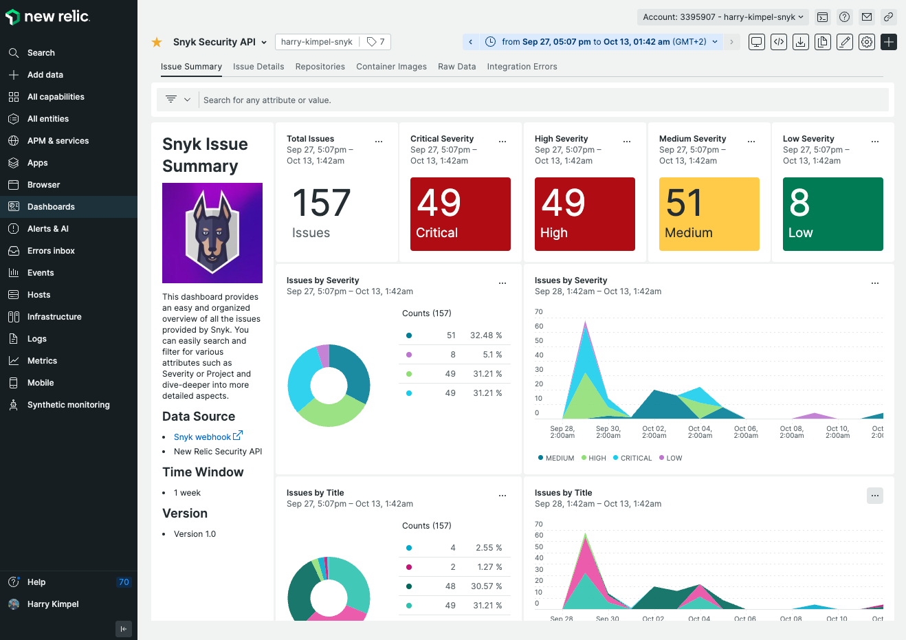

# New Relic Curated UI and Snyk Custom Dashboard

Azure Function과 Snyk Webhook이 생성되면, 구성된 재검사 빈도로 데이터가 수신되거나 재검사를 직접 수행하고 Snyk가 새 문제를 식별한 프로젝트에 데이터가 들어오는 것을 확인할 수 있습니다.

## 취약점 이벤트 유형

New Relic로 데이터가 흐르는 것을 확인하기 위해 취약점 이벤트 유형을 살펴볼 수 있습니다.

<figure><figcaption>
취약점 이벤트 유형
</figcaption></figure>

## New Relic 취약점 관리

또한 New Relic은 취약점 관리라는 New Relic 앱을 제공하여 전달되는 모든 문제를 시각화할 수 있습니다.

<figure><figcaption>
취약점 관리 앱
</figcaption></figure>

<figure><figcaption>
취약점 앱 관리 세부정보
</figcaption></figure>

## Snyk 퀵스타트 템플릿

Snyk 팀은 Snyk에 집중된 방식으로 데이터가 모두 제시되도록하는 샘플 사용자 정의 대시보드를 포함하는 퀵스타트 템플릿도 구축했습니다.

<figure><figcaption>
New Relic Snyk 대시보드
</figcaption></figure>