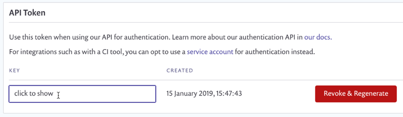

# Snyk API 토큰 폐기 및 재생성


API 토큰을 폐기하면 해당 키를 사용하는 모든 통합이 즉시 작동을 중지합니다. 주의해서 진행하십시오!


만약 API 토큰이 유출되었다고 의심된다면, 해당 토큰을 폐기하고 그 자리에 새로운 것을 생성하는 것이 좋은 실천 방법입니다.

Snyk 사용자 API 토큰을 폐기하려면, Snyk 웹 UI의 개인 일반 계정 설정으로 이동하여 [app.snyk.io/account](https://app.snyk.io/account)를 방문하십시오.

**Revoke & Regenerate** 버튼을 클릭하여 API 토큰을 폐기하십시오. 새로운 토큰이 그 자리에 생성될 것입니다. 이제 새로 생성된 API 토큰을 복사하고 이전 토큰을 사용한 통합을 업데이트할 수 있습니다.