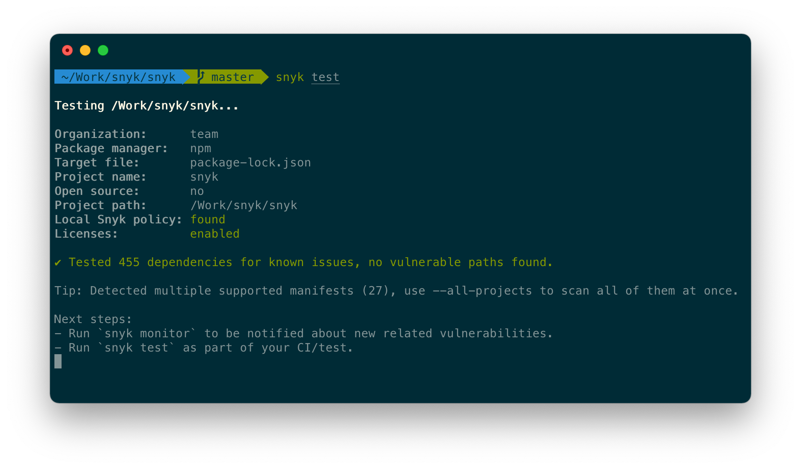

# Snyk CLI 시작하기

## Snyk 및 Snyk CLI에 대한 소개

[Snyk](https://snyk.io/)은 보안 취약점을 스캔하고 모니터링하기 위한 개발자 중심의 클라우드 네이티브 보안 도구입니다. Snyk는 다음과 같은 다양한 콘텐츠 유형에 대해 보안 문제를 스캔합니다:

* [**{{Snyk 오픈 소스}}**](https://docs.snyk.io/scan-using-snyk/snyk-open-source): 오픈 소스 취약점 찾기 및 자동으로 수정하기
* [**{{Snyk 코드}}**](https://docs.snyk.io/scan-using-snyk/snyk-code): 실시간으로 응용 프로그램 코드의 취약점 찾기 및 수정하기
* [**{{Snyk 컨테이너}}**](https://docs.snyk.io/scan-using-snyk/snyk-container): 컨테이너 이미지와 Kubernetes 응용 프로그램의 취약점 찾기 및 수정하기
* [**{{Snyk IaC}}**](https://docs.snyk.io/scan-using-snyk/scan-infrastructure): Terraform 및 Kubernetes 코드의 보안 구성 문제 찾기 및 수정하기

[Snyk가 무엇을 할 수 있는지 알아보고 무료 계정으로 등록하세요](https://snyk.io/).

**{{Snyk CLI는 Snyk 기능을 개발 워크플로우로 가져올 수 있습니다**. CLI를 로컬에서 명령줄 또는 IDE에서 실행할 수 있습니다. 또한 CI/CD 파이프라인에서 CLI를 실행할 수 있습니다. 다음은 Snyk CLI 테스트 명령어의 예제를 보여줍니다.

<figure><figcaption><p>Snyk CLI 테스트 명령어 결과</p></figcaption></figure>

Snyk CLI 스캔은 **다양한 언어 및 도구를 지원**합니다. 자세한 정보는 다음을 참조하세요:

* [오픈 소스 및 {{Snyk 코드}}용 지원되는 언어, 패키지 관리자 및 프레임워크](https://docs.snyk.io/getting-started/supported-languages-frameworks-and-feature-availability-overview)
* [컨테이너 용 지원되는 운영 체제 배포](https://docs.snyk.io/scan-with-snyk/snyk-container/how-snyk-container-works/supported-operating-system-distributions)
* [IaC 언어 및 클라우드 제공 업체 지원](https://docs.snyk.io/scan-with-snyk/snyk-iac/supported-iac-languages-cloud-providers-and-cloud-resources)

이 페이지에서는 CLI를 설치, 인증 및 스캔을 시작하는 방법에 대해 설명합니다. Snyk는 또한 이러한 단계를 안내하는 온보딩 마법사를 제공합니다. 데모를 보려면 [Snyk로 시작: CLI 온보딩 흐름 개요](https://www.youtube.com/watch?v=adj3VF82-v8)을 확인하십시오.

## Snyk CLI 설치 및 기계 인증

CLI를 사용하려면 CLI를 설치하고 기계를 인증해야 합니다. [Snyk CLI 설치 또는 업데이트](https://docs.snyk.io/snyk-cli/install-the-snyk-cli) 및 [계정으로 CLI 인증](https://docs.snyk.io/snyk-cli/authenticate-the-cli-with-your-account)을 참조하십시오. 각 릴리스의 변경 사항 요약은 [릴리스 노트](https://github.com/snyk/cli/releases)를 참조하십시오. 코드를 스캔하기 전에 [Snyk CLI의 코드 실행 경고](https://docs.snyk.io/snyk-cli/code-execution-warning-for-snyk-cli)를 검토하십시오.

**참고:** 오픈 소스 스캔을 위해 CLI를 사용하기 위해서는 패키지 관리자를 설치해야 합니다. Gradle 또는 Maven과 같은 필요한 타사 도구는 `PATH`에 있어야 합니다.

IDE 또는 CI/CD 환경에도 CLI를 설치할 수 있습니다. 자세한 내용은 각 통합에 대한 [IDE 및 CI/CD 설명서](https://docs.snyk.io/scm-ide-and-ci-cd-workflow-and-integrations)를 참조하십시오.

## 설치를 테스트하세요

인증 후 **설치를 테스트**할 수 있습니다. 빠른 테스트를 위해 다음을 실행하세요. `snyk --help`.

또한 예를 들어 공개 npm 패키지에서 **빠른 테스트**를 수행할 수 있습니다. `snyk test ionic`.

터미널에서 `test` 명령 **보고서**를 확인하세요. 보고서는 Snyk가 패키지에서 발견한 취약점을 보여줍니다. 발견된 각 문제에 대해 Snyk는 문제의 심각성을 보고 상세 설명 링크를 제공하며, 취약한 모듈이 시스템에 어떤 경로로 들어갔는지를 보고 문제 해결 방법을 안내합니다.

## 개발 프로젝트를 스캔하세요

**참고:** Open Source 프로젝트에 대한 취약점을 테스트하기 위해 Snyk CLI를 사용하기 전에, 일부 제외 사항을 제외하고는 **프로젝트를 빌드해야 합니다**. 자세한 내용은 [테스트 전에 빌드해야 하는 Open Source 프로젝트](https://docs.snyk.io/snyk-cli/scan-and-maintain-projects-using-the-cli/snyk-cli-for-open-source/open-source-projects-that-must-be-built-before-testing-with-the-snyk-cli)를 참조하십시오.

또한, 오픈 소스 프로젝트의 언어에 따라 Snyk CLI를 사용하기 전에 **언어 환경을 설정**하는 경우가 있습니다. 자세한 내용은 [지원되는 언어, 패키지 관리자 및 프레임워크](https://docs.snyk.io/supported-languages-package-managers-and-frameworks)를 참조하십시오.

CLI를 설치하고 기계를 인증한 후 **오픈 소스 프로젝트를 스캔**하려면 `cd /my/project/`를 사용하여 현재 디렉토리를 `package.json`, `pom.xml`, 또는 `composer.lock`과 같은 지원되는 패키지 매니페스트 파일이 있는 폴더로 변경한 후 `snyk test`를 실행하세요. 모든 식별된 취약점이 목록에 표시됩니다. 취약점의 경로와 수정 지침이 제공됩니다.

소스 코드를 스캔하려면 `snyk code test`를 실행하세요.

예를 들어 태그별 Docker 이미지를 스캔하려면 다음과 같이 실행하세요: `snyk container test ubuntu:18.04`.

**Kubernetes(K8s) 파일을** 스캔하려면 다음을 실행하세요:\
`snyk iac test /path/to/kubernetes_file.yaml`

각 콘텐츠 유형을 스캔하기 위해 Snyk CLI를 사용하는 방법에 대한 자세한 내용은 다음을 참조하십시오:

* [Snyk CLI for {{Snyk Open Source}}](https://docs.snyk.io/snyk-cli/scan-and-maintain-projects-using-the-cli/snyk-cli-for-open-source) 및 [`test`](https://docs.snyk.io/snyk-cli/commands/test) 및 [`monitor`](https://docs.snyk.io/snyk-cli/commands/monitor) 명령에 대한 CLI 도움말
* [Snyk CLI for {{Snyk Code}}](https://docs.snyk.io/snyk-cli/commands/code) 및 [Snyk Code CLI 도움말](https://docs.snyk.io/snyk-cli/scan-and-maintain-projects-using-the-cli/snyk-cli-for-snyk-code)
* [Snyk CLI for {{Snyk Container}}](https://docs.snyk.io/snyk-cli/commands/container) 및 Docker 스캔을 포함한 [Snyk Container CLI 도움말](https://docs.snyk.io/snyk-cli/scan-and-maintain-projects-using-the-cli/snyk-cli-for-snyk-container)
* [Snyk CLI for {{Snyk IaC}}](https://docs.snyk.io/snyk-cli/scan-and-maintain-projects-using-the-cli/snyk-cli-for-iac) 및 Terraform과 Kubernetes(K8s) 프로젝트를 포함한 [Snyk IAC CLI 도움말](https://docs.snyk.io/snyk-cli/commands/iac)

## 오픈 소스 또는 컨테이너 프로젝트 모니터링

Snyk는 오픈 소스 또는 컨테이너 통합 SCM 프로젝트를 주기적으로 모니터링하고 새로운 취약점에 대해 알림을 제공할 수 있습니다. 프로젝트를 모니터링하려면 `snyk monitor` 또는 `snyk container monitor`를 실행하세요.

이렇게 하면 현재 종속성에 대한 스냅샷이 생성되어 Snyk가 코드를 정기적으로 스캔할 수 있게 되며 새로 발표된 취약점이 소개되거나 이전에 사용할 수 없었던 패치 또는 업그레이드 경로가 만들어지면 Snyk가 알림을 제공할 수 있습니다. 아래 코드는 `snyk monitor` 명령의 출력 예제를 보여줍니다.

```
> snyk monitor
Monitoring /project (프로젝트명)...

Explore this snapshot at 
https://app.snyk.io/org/my-org/project/29361c2c-9005-4692
-8df4-88f1c040fa7c/history/e1c994b3-de5d-482b-9281-eab4236c851e

Notifications about newly disclosed issues related to these 
dependencies will be emailed to you.
```

Snyk 계정에 로그인하여 [프로젝트 페이지](https://app.snyk.io/projects)로 이동하여 최신 스냅샷 및 스캔 결과를 확인할 수 있습니다.

<figure><figcaption><p>Snyk 모니터 스냅샷 및 스캔 결과</p></figcaption></figure>

자세한 내용은 [정기적인 간격으로 프로젝트 모니터링](https://docs.snyk.io/snyk-cli/scan-and-maintain-projects-using-the-cli/monitor-your-projects-at-regular-intervals)을 참조하십시오.

## 테스트가 부족합니다

Snyk는 공개 저장소에 대해 무제한 테스트를 허용합니다. 무료 계획을 이용하는 경우 월별로 제한된 횟수의 테스트가 제공됩니다. 유료 계획은 비공개 및 공개 저장소에 대해 무제한 테스트를 제공합니다. 공개 저장소라도 테스트 횟수가 빠르게 소진되는 경우, Snyk CLI가 스캔하는 공개 저장소의 URL을 Snyk에 전달함으로써 이를 조치할 수 있습니다. 이렇게 하면 Snyk가 공개 저장소를 테스트 한도에 고려하지 않습니다.

오픈 소스 프로젝트에서 테스트 횟수가 부족한 경우 다음 단계를 따르세요:

* `snyk monitor` 실행
* Snyk UI에서 프로젝트의 **설정**으로 이동
* **Git 원격 URL**에 오픈 소스 저장소의 URL 입력

## Snyk CLI에 대한 추가 정보

`snyk help`를 실행하거나 [CLI 명령 및 옵션 요약](https://docs.snyk.io/snyk-cli/cli-commands-and-options-summary)을 참조하십시오.

빠른 비디오 교육 세션을 진행하는 [Snyk CLI 소개](https://learn.snyk.io/lesson/snyk-cli/https://learn.snyk.io/lesson/snyk-cli/) 과정을 참조하십시오.

Snyk는 [치트 시트](https://res.cloudinary.com/snyk/image/upload/v1664236143/cheat-sheets/cheat-sheet-snyk-cli-v3.pdf) ([블로그 게시물](https://snyk.io/blog/snyk-cli-cheat-sheet/))와 [동영상 자습서](https://www.youtube.com/watch?v=xp\_LtchEkT8)도 제공합니다.

특히 다음과 같은 유용한 옵션에 대한 정보를 찾아볼 수 있습니다.

* `--severity-threshold=low|medium|high|critical`: 지정된 수준 이상의 취약점만 보고
* `--json`: JSON 형식으로 결과 출력
* `--all-projects`: 작업 디렉터리의 모든 프로젝트 자동 감지

자세한 내용은 [CLI 문서](https://docs.snyk.io/snyk-cli)를 참조하십시오.

## Snyk CLI 지원 받기

Snyk CLI 또는 Snyk의 지원이 필요한 경우 [지원 티켓 제출](https://support.snyk.io)을 하십시오. Snyk 지원은 [Snyk 개발 프로젝트](https://github.com/snyk)의 GitHub Issues를 미주시하지 않음을 참고하십시오.

## Snyk CLI는 기여를 받지 않습니다

2024년 7월 22일부로 Snyk CLI는 외부 기여를 받지 않습니다.

CLI의 광범위한 사용과 복잡한 성격으로 인해 작은 수정조차 뜻밖의 결과를 초래할 수 있습니다. CLI 코드에 릴리즈 채널을 도입한 이후로 Snyk는 릴리스를 안정화하는 데 중점을 두었습니다. Snyk는 이러한