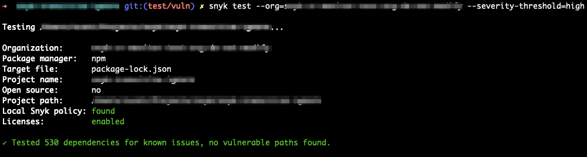

# Snyk CLI에서 빌드 실패

`snyk test` 명령어에는 빌드를 실패시키는 다음 옵션이 있습니다:

- `--severity-threshold=low|medium|high|critical`: 지정된 레벨 이상의 취약점만 보고합니다.
- `--fail-on=all`: 업그레이드나 패치할 수 있는 취약점이 하나 이상 있을 때 실패합니다.
- `--fail-on=upgradable`: 업그레이드할 수 있는 취약점이 하나 이상 있을 때 실패합니다.
- `--fail-on=patchable`: 업그레이드하거나 패치할 수 있는 취약점이 하나 이상 있거나 패치할 수 있거나 업그레이드할 수 있는 취약점이 하나 이상 있을 때 실패합니다.

Snyk CLI 자체에는 복잡한 사용 사례에서 테스트를 실패시키는 능력이 내장되어 있지 않습니다. 보다 복잡한 합격/불합격 기준을 달성할 수 있는 몇 가지 방법을 소개합니다.

## --severity-threshold과 보안 정책 결합

[보안 정책](../../manage-risk/policies/)은 특정 조직을 통해 프로젝트가 테스트될 때 취약점의 심각성을 변경하는 기능을 제공합니다. 예를 들어 취약점의 심각성을 높음에서 낮음으로 변경할 수 있으며, `snyk test`를 옵션 `--severity-threshold=medium|high`와 함께 실행하면 이전에 높은 심각성의 취약점이 더 이상 빌드를 실패시키지 않습니다.


보안 정책은 일부 속성이 기준 일치에 사용할 수 없습니다. 사용 가능한 기준을 확인하려면 보안 정책 구성을 참조하십시오.


다음 예시는 특정 조직에 적용된 정책으로 이전에 높은 심각성의 취약점을 `low`로 낮추는 조직에 대해 `snyk test --severity-threshold=high`를 실행하는 것입니다. 발견된 취약점이 없습니다.

다음 예는 특정 취약점의 심각성을 `low`로 낮추는 정책이 있는 조직에 대해 `snyk test --severity-threshold=high`를 실행하는 것입니다. 발견된 취약점이 없습니다.

## 동반 도구

CLI에는 오픈 소스 스캔을 위한 동반 도구 `snyk-delta`와 `snyk-filter`가 있습니다.

`snyk-delta`는 현재 테스트와 이전에 모니터링된 스냅샷 간의 취약점 차이를 찾습니다. 이 도구는 npmjs.org에서 사용 가능하며 `npm install -g snyk-delta`를 실행하여 CI/CD 파이프라인에 추가할 수 있습니다.

`snyk-filter`는 `snyk test` JSON 출력의 모든 데이터를 기반으로 사용자가 정의한 합격/불합격 기준을 제공합니다. 이 도구는 npmjs.org에서 사용 가능하며 `npm install -g snyk-filter`를 실행하여 CI/CD 파이프라인에 추가할 수 있습니다.

### 새로운 취약점이 도입되는 경우에만 현재 빌드 실패

#### `snyk-delta`의 인라인 모드

간단한 예는 다음과 같습니다: `snyk test --json --print-deps | snyk-delta`

조직과 프로젝트 좌표를 지정하여 특정 스냅샷을 가리킬 수도 있습니다.

`snyk test --json --print-deps | snyk-delta --baselineOrg xxx --baselineProject xxx`

#### 독립형 `snyk delta`

`snyk-delta --baselineOrg xxx --baselineProject xxx --currentOrg xxx --currentProject xxx`

자세한 정보는 [GitHub의 snyk-delta 프로젝트](https://github.com/snyk-tech-services/snyk-delta)를 참조하십시오.

### 지정된 점수보다 높은 CVSS 점수로 빌드 실패하기 - `snyk filter`

`snyk test --json | snyk-filter -f /path/to/example-cvss-9-or-above.yml`

### `snyk filter`를 사용한 사용자 지정 기준 및 필터링

`snyk-filter`는 `snyk test` JSON 출력에서 사용 가능한 기준의 모든 조합을 사용할 수 있습니다.

표시 기준과 빌드 실패 기준이 다를 수 있습니다. 이를 통해 테스트 출력에 모든 취약점을 표시하면서 특정 기준에만 실패할 수 있습니다.

예시 및 자세한 정보는 [GitHub의 snyk-filter 프로젝트](https://github.com/snyk-tech-services/snyk-filter)를 참조하십시오.