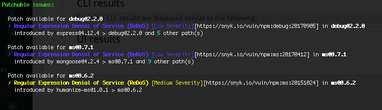

# Snyk CLI를 사용하여 취약점 수정하기

Snyk CLI는 `snyk test` 명령을 사용하여 발견된 취약점을 수정하는 기능을 제공합니다. Web UI에서 수정에 대한 정보를 보려면 [취약점 수정](../../scan-with-snyk/snyk-open-source/manage-vulnerabilities/fix-your-vulnerabilities.md)을 참조하십시오. 패치에 대한 일반 정보는 [취약점 수정을 위한 Snyk 패치](../../scan-with-snyk/snyk-open-source/manage-vulnerabilities/snyk-patches-to-fix-vulnerabilities.md)를 참조하십시오.

`snyk container test`를 사용하는 경우, 스캔에서 발견된 취약점을 해결하는 정보는 [Snyk Container CLI 결과 이해](snyk-cli-for-snyk-container/understand-snyk-container-cli-results.md)를 참조하십시오. `snyk code test`를 사용하는 경우 [Snyk Code CLI 결과 보기](snyk-cli-for-snyk-code/view-snyk-code-cli-results.md)를 참조하십시오. `snyk iac test`를 사용하는 경우 [IaC CLI 테스트 결과 이해](snyk-cli-for-iac/understand-the-iac-cli-test-results/)를 참조하십시오.

## CLI에서 업그레이드 및 패치 결과

CLI에서는 각 목록(업그레이드 및 패치)에 대한 결과가 Snyk가 수정할 것으로 권장하는 패키지를 기반으로 그룹으로 표시됩니다. 결과에는 다음이 포함됩니다:

* 패키지 당 도입된 모든 취약점에 대한 세부 정보; 영향을 받는 모든 종속성 경로를 확인하려면 `snyk test` 또는 `snyk monitor` 실행 시 `--show-vulnerable-paths=all`을 사용하십시오.
* 각 취약점에 대한 전체 설명 링크

업그레이드 및 패치 결과는 다음과 유사합니다:

<figure><figcaption>
CLI에서 업그레이드 결과
</figcaption></figure>

패치 권장 사항은 다음과 유사합니다:

<figure><figcaption>
CLI에서 패치 결과
</figcaption></figure>

## CLI를 사용하여 취약점 수정하는 Snyk 패치

`protect` 명령은 `@snyk/protect`로 대체되었습니다: [https://github.com/snyk/snyk/tree/master/packages/snyk-protect](https://github.com/snyk/snyk/tree/master/packages/snyk-protect); [`snyk-protect` 명령용 npm 패키지](https://www.npmjs.com/package/@snyk/protect). 이 페이지에는 패키지 사용 방법과 `snyk protect`에서 마이그레이션하는 방법에 대한 지침이 있습니다.
