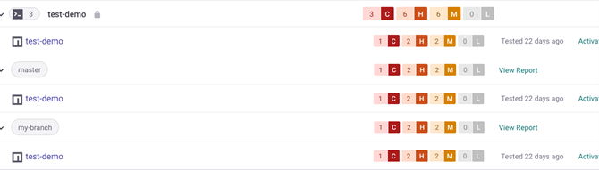

# 분기 또는 버전별로 프로젝트 그룹화하여 모니터링하기


**기능 사용 가능 여부**

분기 또는 버전별로 프로젝트 그룹화 기능은 엔터프라이즈 요금제에서만 사용할 수 있습니다. 자세한 정보는 [요금제 및 가격 책정](https://snyk.io/plans)을 참조하십시오.

해당 기능은 오픈 소스 영역에서 지원됩니다.


귀하의 프로젝트에는 분기, 릴리스 또는 배포와 같이 각각 별도로 모니터링하고 싶은 여러 상태가 있을 수 있습니다. `--target-reference` 옵션을 사용하여 프로젝트를 이러한 구체적인 그룹으로 분리할 수 있습니다.

`--target-reference`는 모든 텍스트를 사용할 수 있으므로 해당 값을 자동으로 설정하는 명령어와 결합할 수 있습니다. 아래는 예시입니다.

현재 Git 분기에 `--target-reference` 설정하기.

```
snyk monitor --target-reference="$(git branch --show-current)"
```

최신 Git 태그 사용하기.

```
snyk monitor --target-reference="$(git describe --tags --abbrev=0)"
```

프로젝트에서 사용하는 개발자 도구에 옵션을 조정할 수 있습니다. 유효한 Git 대상을 사용할 수 있습니다.

`--target-reference`를 사용하면 프로젝트 페이지에서 하위 그룹을 생성할 수 있습니다.

<figure><figcaption><p>하위 그룹이 있는 프로젝트 페이지.</p></figcaption></figure>