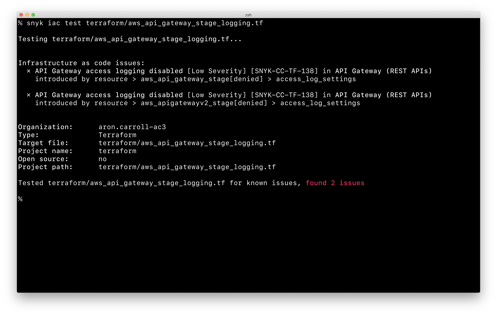
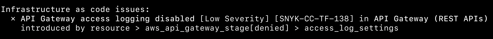

# Snyk IaC CLI 테스트 결과(버전 1.938.0 이하)


이 섹션의 지침은 Terraform, Kubernetes, CloudFormation 및 ARM을 포함한 Snyk Infrastructure as Code에서 지원하는 모든 파일 형식에 적용됩니다.


Snyk은 구성 파일을 분석하여 문제를 찾고 해결할 수 있도록 도와드립니다.

예를 들어, Terraform 파일을 스캔하는 경우 다음 명령을 실행하십시오:

```
snyk iac test aws_api_gateway_stage_logging.tf
```

이 명령을 실행한 결과는 다음과 같습니다:

<figure><figcaption><p>snyk iac test output</p></figcaption></figure>

이 결과에는 심각도별로 정렬된 문제 목록이 포함되며, 각 문제에는 다음과 같은 세부 정보가 포함됩니다:

* **Heading** - 문제의 검출된 내용, 문제의 심각도 및 해당 특정 문제에 대한 Snyk 정책 ID.
* **Location** - 문제가 식별된 구성 파일 내의 속성 경로입니다. 자세한 내용은 다음 예제를 참조하십시오.

<figure><figcaption><p>속성 경로 예제</p></figcaption></figure>

이 문제의 경로는 다음과 같이 지정됩니다:

```
resource > aws_api_gateway_stage[denied] > access_log_settings
```

다음 예제는 `access_log_settings` 필드가 없는 "**denied**"로 불리는 `aws_api_gateway_stage` 블록의 내용을 나타냅니다.


```
resource "aws_api_gateway_stage" "denied" {
  xray_tracing_enabled = true
}
```

