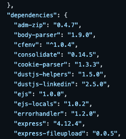
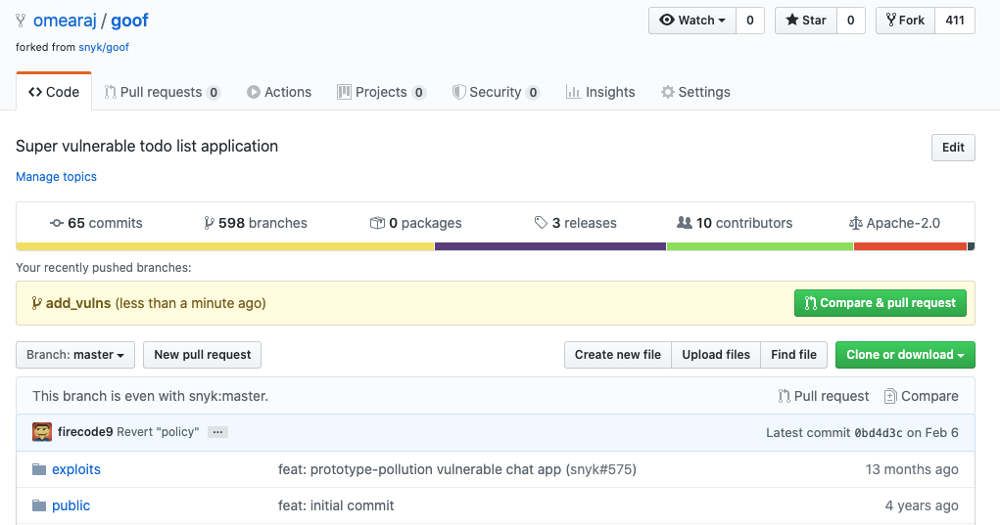

# CLI를 사용하여 Snyk을 워크플로에 통합하기

이 페이지는 [Snyk CLI](../../)를 사용하여 GitHub 작업 흐름에 Snyk 통합하는 예시를 제공합니다.

### 단계 1: 환경 설정

1.  [Snyk CLI](../../)를 열고 **goof** 저장소에 대한 git clone 명령을 실행합니다.

    ```
       git clone https://github.com/snyk/goof.git
    ```
2.  새 브랜치를 생성하고 해당 브랜치에 취약점을 추가한 후 변경 사항을 GitHub로 다시 병합할 Pull Request를 생성합니다:

    ```
       git branch add_vulns
       git checkout add_vulns
    ```

### 단계 2: 오픈 소스 종속성 추가

클론된 goof 애플리케이션의 **package.json** 매니페스트 파일을 검토하여 여러 직접 종속성이 나열되어 있는지 확인합니다.

<figure><figcaption><p>패키지.json 파일의 종속성 목록</p></figcaption></figure>


이러한 직접 종속성들은 추가적으로 의존하는 라이브러리(트랜지티브 종속성)를 가질 수 있습니다.


종속성을 추가하려면:

*   종속성 목록 가장 아래에 **tinymce 4.1.0** 라이브러리를 추가합니다:

    ```
    {
    "name": "goof",
    ...
    }
    "dependencies" {
    ...
    "typeorm": "^0.2.24",
    "tinymce": "4.1.0"
    },
    ...
    ```

````

<div data-gb-custom-block data-tag="hint" data-style='info'>

팁: 이전 종속성 뒤에 쉼표를 추가하는 것을 잊지 마세요.

</div>

* Node 애플리케이션을 위해 [lock 파일](https://docs.npmjs.com/files/package-lock.json)을 생성합니다:

    ```
    npm install --package-lock
    ```

<div data-gb-custom-block data-tag="hint" data-style='info'>

팁: 이미 파일이 존재한다면, 제거하려면 rm package-lock.json을 실행하십시오.

</div>

### 단계 3: 변경 내용 커밋 및 검토

* 변경 사항을 로컬로 커밋하고, 로컬 git 리포지토리에서 변경 사항의 상태를 확인한 후 변경 사항을 로컬 git에 추가하고, 커밋합니다:

    ```
   git status
   git add package*
   git commit -m "adding tinymce v4.1.0"
    ```

* 로컬 코드 변경 사항을 GitHub에 커밋하여 파일과 히스토리를 GitHub의 원격 git 리포지토리로 전달합니다:

    ```
   git push --set-upstream origin add_vulns
    ```

    ```
GitHub에서 **add_vulns** 브랜치에 변경 사항을 받았습니다.
    ```

* GitHub에서 **Compare & pull request**를 클릭하여 **add_vulns** 브랜치와 **master** 브랜치를 비교하고 풀 요청을 생성합니다:

<figure><figcaption><p>GitHub에서 풀 요청 정보</p></figcaption></figure>

### 단계 4: Snyk PR Checks 사용

Snyk 병합 프로세스에서 풀 요청(PR)을 자동으로 스캔하여 취약점 및 라이선스 문제를 확인할 수 있습니다:

<figure><figcaption><p>GitHub에서 Snyk 풀 요청 검사</p></figcaption></figure>

PR 작업 흐름이 완료되면, Snyk 프로젝트에 대해 설정된 취약점 및 라이선스 정책을 유효성 검사합니다. 정책에 따라 검사가 통과하거나 실패하며, 이 내용은 GitHub에 표시됩니다.

이를 통해 보안 게이트를 설정하고 새로운 취약점이나 라이선스 정책을 충족하지 못하는 새로운 오픈 소스 라이브러리를 소스 코드 기준선에 추가하는 것을 방지할 수 있습니다.
````
