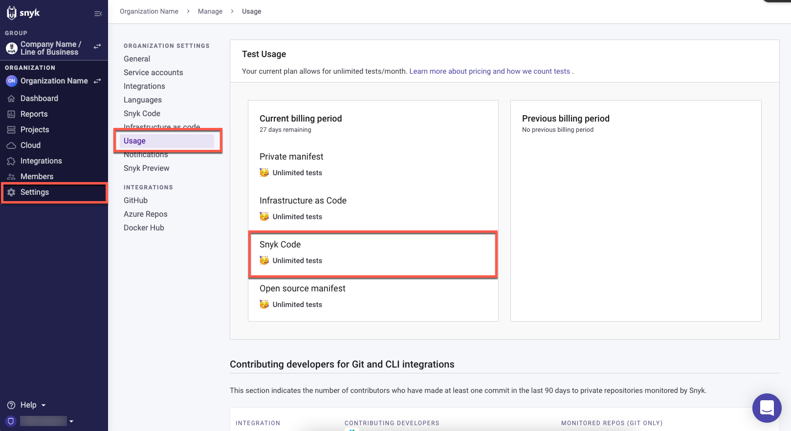
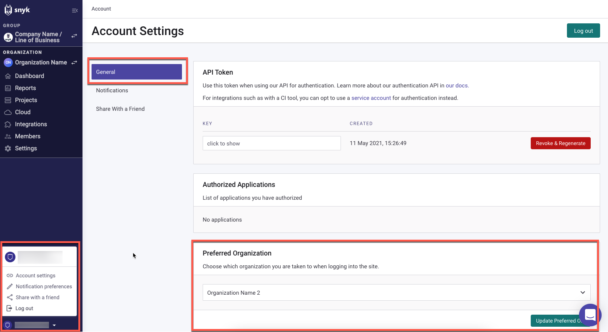
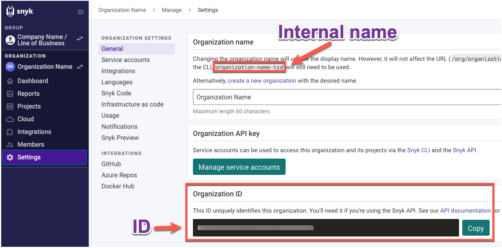

# CLI 테스트를 위한 Snyk 조직 설정하기

Snyk 계정에 여러 조직이 있는 경우 CLI를 사용하여 코드를 테스트하기 전에 테스트 수를 지정할 Snyk 조직을 지정해야합니다.

CLI 테스트 수는 조직 **설정** 페이지 -> **사용량** 탭 -> **테스트 사용량** 섹션 -> \*\*\*\* 필드에서 확인할 수 있습니다:

<figure><figcaption><p>허용된 테스트 사용량</p></figcaption></figure>

기본적으로 CLI는 **계정 설정**에서 정의된 **기본 조직**에서 테스트를 실행합니다:

<figure><figcaption><p>Snyk 계정 설정의 기본 조직</p></figcaption></figure>

CLI 테스트를 위해 조직을 설정할 때 두 가지 옵션이 있습니다:

* [CLI 테스트를 위해 기본적으로 조직 설정](set-the-snyk-organization-for-the-cli-tests.md#기본적으로-cli-테스트를위한-조직-설정)
* [특정 CLI 테스트를 위해 로컬로 조직 설정](set-the-snyk-organization-for-the-cli-tests.md#특정-cli-테스트를-위해-로컬로-조직-설정)

## Snyk 조직의 ID 및 내부 이름 찾기

CLI 테스트를 위해 조직을 설정할 때 조직 ID 또는 조직 내부 이름을 사용할 수 있습니다. 이러한 조직 식별 세부 정보는 각 조직이 생성될 때 Snyk에 의해 자동으로 생성됩니다. 명령에 입력할 값을 **조직** 이름으로 표시됩니다. 조직의 Snyk ID 및 내부 이름은 웹 UI의 조직 **설정** 페이지에서 찾을 수 있습니다.

조직 ID와 내부 이름을 찾으려면 다음 단계를 따르십시오:

1\. Snyk 웹 UI에서 원하는 조직을 엽니다:

<figure><figcaption><p>세부 정보를 찾기 위해 조직 열기</p></figcaption></figure>

2\. 선택한 조직이 열리면 **Org 설정**을 클릭합니다.

3\. 조직의 **설정** 페이지에서 다음을 찾기 위해 **일반** 탭을 선택합니다:

* **내부 이름:** **조직 이름** 섹션에 기재되어 있음.
  * 조직의 표시 이름은 변경할 수 있지만 내부 이름은 변경할 수 없음.
  * 내부 이름은 또한 조직의 URL에 표시됨.
  * CLI 테스트를 위해 조직을 설정할 때 내부 이름을 사용할 경우 **설정** 페이지에서 이름을 복사합니다. 내부 이름은 항상 소문자로 작성됩니다.
* **ID:** **조직 ID** 섹션에 표시됩니다. CLI로 ID를 복사할 수 있습니다.

<figure><figcaption><p>조직 이름 및 ID</p></figcaption></figure>

## CLI 테스트를 위해 전역적으로 기본 조직 설정

CLI를 통해 모든 CLI 테스트에 대해 전역적으로 기본 조직을 설정할 수 있습니다. 이 기본 조직은 [기본 조직으로 설정](../../../snyk-admin/groups-and-organizations/organizations/create-and-delete-organizations.md)된 조직을 덮어씁니다. 이 명령을 입력할 때 새 기본 조직의 [ID 또는 내부 이름](set-the-snyk-organization-for-the-cli-tests.md#find-snyk-id-and-internal-name-of-an-organization)을 사용할 수 있습니다.

글로벌 기본 조직을 설정하려면 터미널에서 다음을 입력하십시오.

```
snyk config set org=<ORG_ID_or_ORG_INTERNAL_NAME>
```

다음 확인을 받게 됩니다:

```
org updated
```

이제부터 모든 CLI 테스트는 지정된 조직 아래에서 실행됩니다.

예를 들어, CLI 테스트의 기본 조직으로 Snyk 데모 조직을 설정하려면 조직 ID를 사용하여 다음을 입력하십시오:

```
snyk config set org=a7708807-3881-xxxx-xxxx-xxxxxxxxxxxx
```

<figure><figcaption><p>조직 설정 및 확인 명령</p></figcaption></figure>

이제부터 모든 CLI 테스트는 기본적으로 Snyk 데모 조직으로 실행되며 Snyk 데모 조직 ID가 테스트 결과에 표시됩니다:

<figure><figcaption><p>Snyk 데모 조직 ID 표시 결과</p></figcaption></figure>

## 특정 CLI 테스트를 위해 로컬로 조직 설정

기본 조직과 다른 조직 아래에서 특정 CLI 테스트를 실행할 수 있습니다. 이 옵션을 사용할 때 지정된 조직은 특정 CLI 테스트에서 기본 조직을 덮어씁니다. 명령에는 조직의 [ID 또는 내부 이름](set-the-snyk-organization-for-the-cli-tests.md#find-snyk-id-and-internal-name-of-an-organization)을 사용할 수 있습니다.

터미널에서 특정 CLI 테스트를 위해 조직을 설정하려면 `test` 명령 뒤에 다음을 입력하십시오.

```
--org=<ORG_ID_or_ORG_INTERNAL_NAME>
```

예를 들어, 특정 CLI 테스트를 위해 Snyk Test 조직을 사용하려면 조직 내부 이름을 사용하여 다음을 입력하십시오:

```
snyk code test --org=snyk-xxxx-xxx
```

이 테스트 결과에 Snyk Test 조직의 내부 이름이 표시됩니다:


