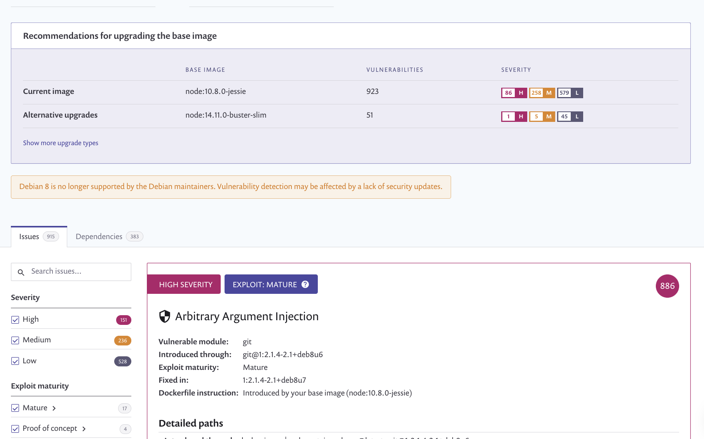

# 이미지 스캔 및 모니터링

{Snyk} Container와 함께 `test`와 `monitor` 명령어를 함께 사용하는 것이 일반적입니다. 빠른 확인을 위해 `snyk container test` 명령어를 사용할 수 있습니다. 지속적인 보증 및 결과를 쉽게 공유하기 위해 `snyk container monitor` 명령어를 사용할 수도 있습니다.

## 이미지 스캔

이미지를 스캔하려면 `container test` 명령어를 실행하십시오. 예를 들어:

```
snyk container test debian
```

이 명령어는 다음을 수행합니다:

1. 이미지를 다운로드합니다(로컬 Docker 데몬에 이미지가 없는 경우).
2. 이미지에 설치된 소프트웨어를 결정합니다.
3. 의존성 목록을 Snyk 서비스에 보냅니다.
4. 이미지의 취약점 목록을 반환합니다.

원격 레지스트리에서 끌어올 수 있는 이미지나 로컬에서 빌드하고 로컬 Docker 데몬에 이용 가능한 이미지를 테스트할 수 있습니다:

```
snyk container test <repository>:<tag>
```

이미지를 빌드하는 데 Dockerfile을 사용하는 경우, `snyk container test`를 실행할 때 이를 지정할 수 있습니다:

```
snyk container test <repository>:<tag> --file=Dockerfile
```

Dockerfile을 지정하면 Snyk에서 발견된 취약점을 어떻게 해결할지에 대한 명확한 권장 사항을 제공할 수 있습니다.

Snyk는 현재 이미지에서 애플리케이션 취약점을 기본적으로 감지합니다.

## 이미지 모니터링

{Snyk} Container에서는 이미지를 모니터링할 수도 있습니다. 이에는 다음 이점이 있습니다:

* Snyk는 이미지에 영향을 미치는 새로운 취약점이 공개될 경우 이미지 지역적으로 다시 테스트하지 않아도 경고를 표시합니다.
* Snyk는 결과를 대화식으로 필터링하고 웹 브라우저에서 이미지의 취약점 목록을 살펴볼 수 있습니다.
* 동료 팀원들과 Snyk에서 결과를 공유할 수 있습니다.

컨테이너 보안에 대해 자세히 알아보려면 [컨테이너 모니터링의 중요성](https://snyk.io/learn/container-security/container-monitoring/)을 참조하십시오.

[유료 요금제](https://snyk.io/plans) 사용자는 모든 프로젝트에서 발견된 취약점의 집계 보고서에 액세스할 수도 있습니다.

이미지를 모니터링하려면 `container monitor` 명령어를 실행하십시오:

```
snyk container monitor <repository>:<tag>
```

이 명령어는 다음을 수행합니다:

1. 이미지를 다운로드합니다(로컬 Docker 데몬에 이미지가 없는 경우).
2. 이미지에 설치된 소프트웨어를 결정합니다.
3. 의존성 목록을 Snyk 서비스에 보냅니다.
4. 결과를 볼 수 있는 Snyk 서비스 링크를 반환합니다.

<figure><figcaption><p>기본 이미지 업데이트 권장 사항</p></figcaption></figure>