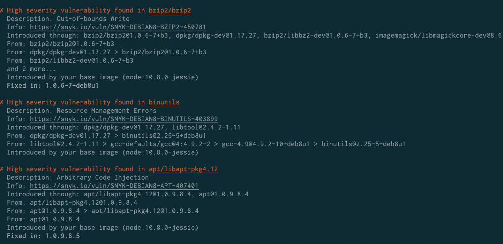
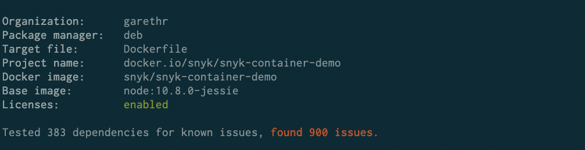
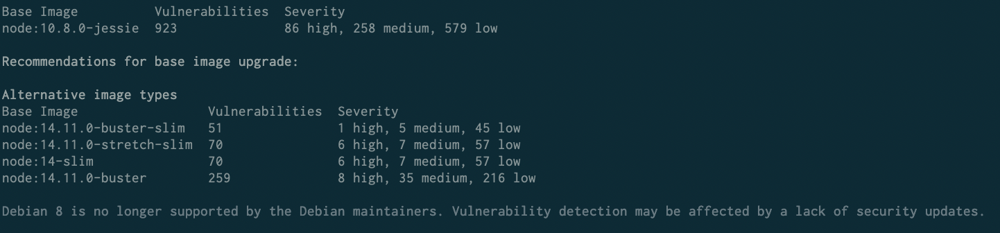

# {{Snyk Container}} CLI 결과 이해

## **취약점 정보**

Snyk Container이 취약점을 감지하면 다음과 같이 출력됩니다:

<figure><figcaption>
{{Snyk Container}}에서 감지된 취약점
</figcaption></figure>

각 취약점에는 다음 정보가 포함됩니다:

| **필드**              | **설명**                                                                                                                                                                                                                                    |
| ---------------------- | -------------------------------------------------------------------------------------------------------------------------------------------------------------------------------------------------------------------------------------------------- |
| **심각도**           | 해당 취약점의 중요성. 자세한 정보는 [Linux 취약점의 심각도 수준](../../../scan-with-snyk/snyk-container/how-snyk-container-works/severity-levels-of-detected-linux-vulnerabilities.md)를 참조하십시오. |
| **명확한 제목**    | 취약점 및 해당하는 패키지에 대한 요약.                                                                                                                                                                                         |
| **설명**        | 문제 유형 또는 공통 취약점 및 노출(CVE) 참조의 간단한 설명, 경우에 따라 CVE가 있을 수 있음.                                                                                                                                  |
| **정보**               | 공급 업체 소스 및 전역 취약점 데이터베이스로 연결된 취약점 세부 정보에 대한 링크.                                                                                                                                         |
| **소개됨** | 취약점이 영향을 미치는 최상위 패키지 이름.                                                                                                                                                                                        |
| **소스**               | 영향을 받는 패키지가 이미지에 어떻게 들어왔는지.                                                                                                                                                                                                 |
| **소개된 사람**      | 취약점이 기본 이미지에 있는지 또는 Dockerfile에서 취약점이 도입된 라인.                                                                                                                                       |
| **수정 버전**           | 가능한 경우, 취약점에 대한 수정 버전의 패키지 버전.                                                                                                                                                                     |

취약점은 심각도의 역순으로 표시되므로 가장 중요한 문제를 먼저 볼 수 있으며 스크롤이 제한적으로 필요합니다.

Snyk는 또한 알려진 취약점을 위해 검사된 총 의존성 및 전체 취약점 수를 보고합니다.

<figure><figcaption>
검사된 총 의존성 및 발견된 문제 예
</figcaption></figure>


Snyk는 여러 패키지에서 발견된 취약점을 그룹화합니다. 이는 인스턴스보다는 취약점 수에 집중할 수 있도록 도와줍니다.


## 베이스 이미지 권장 사항

Snyk가 베이스 이미지를 식별하고 이미지가 [공식 Docker 이미지](https://docs.docker.com/docker-hub/official\_images/)를 사용하는 경우, 출력에는 발견된 취약점 중 일부를 수정하기 위한 업그레이드 권장 사항이 포함됩니다.

<figure><figcaption>
베이스 이미지를 업그레이드하는 권장 사항 예
</figcaption></figure>

이로써 취약성 카운트를 보여주며, 미세 및 주요 업그레이드 또는 더 적은 취약점이 있는 대체 베이스 이미지에서의 취약성을 보여줍니다.