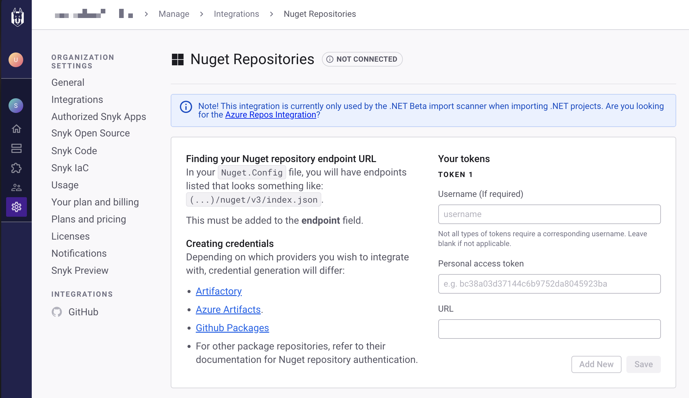

# .NET 스캔 개선


**릴리스 상태 및 기능 가용성**

개선된 {{Snyk 오픈 소스}} NuGet .NET 어플리케이션 스캔은 [얼리 엑세스](../../getting-started/snyk-release-process.md#early-access)에 있으며 엔터프라이즈 요금제 고객만 사용 가능합니다. 자세한 정보는 [요금제 및 가격](https://snyk.io/plans/)를 참조하십시오.

[Snyk Preview](../../snyk-admin/snyk-preview.md)를 사용하여 기능을 활성화할 수 있습니다.



얼리 엑세스 중이므로이 기능은 스캔이 실패하거나 다른 결과물이 생성될 수 있습니다. Snyk는 조직의 하위 집합을 시작하여이 기능을 점진적으로 활성화하는 것을 권장합니다. 자세한 정보는 [엔터프라이즈 설정](https://docs.snyk.io/enterprise-configuration)을 참조하십시오.

[support ticket](https://support.snyk.io)를 제출하여 문제를 보고할 수 있습니다.


## 기존 솔루션의 한계

Snyk 웹 UI 및 CLI에 대한 기존 .NET 스캔 솔루션은 두 가지 [다른 방법](guidance-for-snyk-for-.net.md#dependency-analysis)을 사용하여 SCM 통합을 위해 Dependency Analysis를 수행합니다. SCM 통합의 Dependency Analysis는 수동으로 무시해야 하는 해결책이 없는 거짓 양성을 생성할 수 있습니다.&#x20;

CLI를 사용하여 프로젝트를 스캔하는 경우, SCM 통합을 사용하여 동일한 프로젝트를 가져 오는 것보다 더 정확한 결과를 기대할 수 있습니다. 특정 .NET 기능을 사용하는 프로젝트를 스캔할 때 [오류가 발생](troubleshooting-snyk-for-.net.md#not-supported-in-snyk-open-source-for-.net)할 수 있습니다.

## 스캔 개선

Snyk는 .NET 스캔 프로세스를 개선하여 CLI 및 SCM 통합 간에 의존성 결과가 일관되도록 보장합니다. 이 업데이트는 이전에 UI에 표시된 런타임 의존성에서 나타난 잘못된 양성을 제거합니다. 이 접근 방식은 .NET 생태계의 내부 작업을 사용합니다.

개선된 .NET 스캔은 또한 `dotnet` SDK로 성공적으로 빌드할 수있는 모든 프로젝트를 스캔할 수있는 기능을 제공하여 `.props` 파일, `global.json`, 또는 중앙 패키지 관리를 사용하는 프로젝트를 스캔할 수없는 이전 제한을 제거합니다.

## SCM 통합을 위한 .NET 스캔 개선


Snyk 브로커는 지원되지 않습니다.


.NET 스캔 개선은 Git 저장소 통합을 사용하여 프로젝트를 가져올 때 사용할 수 있습니다.

**다음 단계를 따라 개선 사항을 활성화하십시오:**

1. [Snyk Preview](../../snyk-admin/snyk-preview.md) 메뉴를 통해 조직 또는 그룹에 대한 개선된 .NET 스캔을 활성화합니다.
2. .NET 어플리케이션을 사용하는 저장소를 다시 가져 오세요; **기존 프로젝트를 다시 테스트하는 것으로는 충분하지 않습니다.**

### 개인 패키지 리포지토리 통합

개선된 .NET 솔루션에서는 .NET 프로젝트를 빌드하므로, Snyk는 모든 개인 NuGet 저장소에 액세스해야 합니다.&#x20;

권장되는 접근 방식은 [`nuget.config`](https://learn.microsoft.com/en-us/nuget/reference/nuget-config-file) 파일을 사용하고 Snyk NuGet 개인 패키지 리포지토리 통합 (**Settings > Integrations > NuGet**)에서 자격 증명을 등록하는 것입니다.

<figure><figcaption><p>Settings, Integrations 화면에서 Nuget Repositories 설정</p></figcaption></figure>

만약 `nuget.config`를 사용하지 않고 .NET 생태계에 개인 패키지를 어디에서 찾을지 알려주는 다른 방법을 사용 중이라면, Snyk는 프로젝트를 복원하기 전에 개인 NuGet 저장소 통합에 정의된 모든 개인 NuGet 저장소 자격 증명을 `dotnet nuget` 소스로 추가하려고 합니다.

### SCM 통합을 위한 개선된 .NET 스캔의 한계

* `Directory.Build.props`, `global.json` 및 기타 .NET 특정 매니페스트 파일은 지원됩니다. 그러나 파일 이름은 Microsoft가 [설명한대로](https://learn.microsoft.com/en-us/visualstudio/msbuild/customize-by-directory?view=vs-2022#directorybuildprops-and-directorybuildtargets) 대소문자를 사용해야 합니다.&#x20;
* `global.json`의 경우, Snyk는 현재 Microsoft에서 지원하는 모든 `major.minor.patch` 버전을 지원하지 않으며 그 중 일부만 지원합니다. 자세한 내용은 이 [오류 코드](https://docs.snyk.io/scan-with-snyk/error-catalog#snyk-os-dotnet-0008)를 참조하십시오.
* 작업은 **대소문자를 구분**하는 파일 시스템에서 수행됩니다. 따라서 `<ProjectReference>`와 같은 매니페스트 정의는 동일한 대소문자의 파일 및 폴더와 일치해야 합니다.
* Snyk는 Visual Studio Build Tools를 사용하는 프로젝트를 지원하지 않습니다.&#x20;
* Snyk는 .NET 프로젝트의 Windows 전용 프레임워크 (WPF, WCF)를 지원하지 않습니다.

## Snyk CLI를 위한 .NET 스캔 개선

.NET 스캔 개선은 Snyk CLI에서도 [snyk test](../../snyk-cli/commands/test.md) 및 [`snyk monitor`](../../snyk-cli/commands/monitor.md) 명령에 모두 사용할 수 있습니다.

**다음 단계를 따라 개선 사항을 활성화하십시오:**

1. CLI의 최신 버전을 [설치](../../snyk-cli/install-or-update-the-snyk-cli/)합니다.
2. `dotnet restore`를 실행합니다.
3. `snyk test` 또는 `snyk monitor`를 사용하여 .NET 프로젝트를 스캔하지만 `--dotnet-runtime-resolution` 옵션을 추가합니다.

`--dotnet-runtime-resolution` 옵션은 `--all-projects`와 함께 작동합니다.

예: `snyk test --dotnet-runtime-resolution`

CLI의 개선된 .NET 스캔은 빌드 매니페스트에서 **여러 대상 프레임워크를 지원**합니다.&#x20;

기본적으로 솔루션은 모든 대상 프레임워크를 스캔합니다. 개별 대상 프레임워크를 스캔하려면 CLI 명령에 `--dotnet-target-framework=net8.0` 옵션을 추가해야 합니다.

예: `snyk test --dotnet-runtime-resolution --dotnet-target-framework=net8.0`

## CLI 및 SCM을 위한 .NET 스캔 방법

Snyk가 최신 .NET으로 프로젝트를 스캔하면 `SnykTest`라는 환경 변수가 사용 가능해집니다. 이 환경 변수를 사용하여 스캔을 방해할 수있는 도구를 실행하지 않도록 조건을 설정할 수 있습니다. 다음 예제는 `SnykTest` 변수를 사용하여 스웨거(command을 실행하지 않도록 하는 방법을 보여줍니다:


```
<Target Name="GenerateSwaggerFiles" AfterTargets="Build" Condition="'$(SnykTest)' != 'true'">
    <Exec Command="<dotnet-swagger-command>" />
</Target>
```


## 지원되는 .NET 버전

개선된 .NET 스캔 기능은 Microsoft에서 [지원되는](https://dotnet.microsoft.com/en-us/platform/support/policy/dotnet-core) 모든 .NET core 버전을 지원합니다.

SCM 통합을 사용하여 지원되지 않는 .NET 프로젝트를 가져 오면 개선된 .NET 스캔 기능이 활성화되지 않고 레거시 스캔 방법으로 되돌아갑니다.

사용된 `<TargetFramework>` 목록은 [Microsoft에서 현재 지원하는](https://learn.microsoft.com/en-us/dotnet/standard/frameworks#supported-target-frameworks) 것과 호환되어야만 Snyk 스캐너에서 올바르게 선택됩니다.