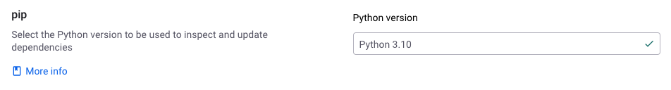

# Git 리포지토리 및 Python

## Git 프로젝트에서 Python 버전 설정

지원되는 Python 버전은 `2.7`, `3.7`, `3.8`, `3.9`, `3.10`,`3.11`,`3.12` 입니다.

Git에서 가져온 Pip 프로젝트를 스캔할 때, Snyk는 조직 설정이나 `.snyk` 파일에 지정된 Python 버전을 사용합니다.

Snyk는 지원되는 각 `minor` 버전에 대해 최근의 `patch` 버전을 사용합니다.

기본적으로 Snyk는 Python 3.7을 사용하여 Pip 프로젝트를 테스트합니다.


Python 버전을 더 높은 버전을 요구하는 종속성을 가진 프로젝트의 경우, 가져오기, 재테스트 및 PR 확인 동작은 지정된 버전에 따라 다릅니다:

* Python 3.8 이상: 스캔이 실패하며 [에러](../../scan-with-snyk/error-catalog.md) 메시지가 표시되며 첫 번째 실패한 패키지, 해당 패키지가 요구하는 Python 버전 및 사용된 Python 버전의 세부 정보가 포함됩니다.
* Python 2.7 또는 3.7: 스캔은 성공하지만 호환되지 않는 종속성은 결과에서 제외됩니다.


Snyk가 Git에서 가져온 Pip 프로젝트를 테스트할 때 사용할 Python minor 버전을 정의하려면 조직 설정과 [.snyk 폴리시 파일](../../manage-risk/policies/the-.snyk-file.md)을 사용할 수 있습니다.

조직 내 모든 프로젝트에 대한 Python 버전을 정의하려면:

1. Snyk 계정에 로그인하고 해당 그룹 및 조직으로 이동합니다.
2. **Settings**를 선택한 다음 **Languages**를 선택합니다.
3. **Python**에 대한 **Edit settings**를 선택합니다.
4. **Python version** 드롭다운에서 이 조직의 프로젝트를 테스트할 때 사용할 Python 버전을 선택합니다.

<figure><figcaption><p>Pip Python 버전 설정</p></figcaption></figure>

조직 내의 프로젝트가 다른 Python 버전을 사용해야 하는 경우, 프로젝트 리포지토리에 `.snyk` 파일을 추가하고 원하는 버전을 지정할 수 있습니다.

```python
language-settings:
  python: '3.10'
```

`.snyk` 파일은 프로젝트 매니페스트 파일과 동일한 디렉토리에 있어야 합니다.

Snyk는 `.snyk` 파일에 지정된 `major`, `minor` 및 `patch` 버전에 따라 사용할 Python 버전을 선택합니다.

* `Major` 버전만 (예: 2 또는 3): 기본 `minor` 버전인 2.7 또는 3.7로 스캔됩니다.
* `Major` 및 `minor` 버전 (예: 3.7, 3.8, 3.9, 3.10, 3.11, 3.12): 3.7, 3.8, 3.9, 3.10, 3.11 또는 3.12로 스캔됩니다.
* `Major`, `minor` 및 `patch` 버전 (예: 3.8.x, 3.9.x, 3.10.x, 3.11.x, 3.12.x): 특정 `patch` 버전은 무시되며, 프로젝트는 3.8, 3.9, 3.10, 3.11 또는 3.12의 기본 버전으로 스캔됩니다.
* 지원되지 않는 `minor` 버전이 지정된 경우: 2.7 또는 3.7로 기본값으로 설정됩니다.

### Git 리포지토리 통합 및 Python을 위한 Snyk

프로젝트를 스캔하려면 리포지토리에 지원되는 매니페스트 파일이 포함되어 있는지 확인해야 합니다.

### Pip 및 Git 리포지토리


개인 PyPI 저장소 및 `file://` URL은 지원되지 않습니다.

`requirements.txt` 파일에서의 `--index-url,` `-i, file://` 및 일반 URL은 스캔되기 전에 제거됩니다. 남은 종속성은 제대로 스캔 결과에 포함되어야 합니다.



Linux에서 지원되지 않는 운영 체제별 Python 패키지는 Snyk SCM 스캔과 호환되지 않을 수 있어 오류가 발생할 수 있습니다.



다운로드된 종속성이 10GB를 초과하는 프로젝트는 지원되지 않습니다.


Pip 프로젝트를 스캔하려면, Snyk는 단독 Linux 환경에서 원시 `pip` 도구를 사용하여 `requirements.txt` 파일을 분석합니다.

Git 통합을 사용하여 스캔된 Pip 프로젝트는 위치한 디렉터리의 이름과 동일한 이름이 부여됩니다.

Snyk는 `**/*req*.txt` 패턴을 따르는 파일을 가져옵니다. 예를 들어 `requirements.txt` 파일을 `requirements-dev.txt`와 같이 이름을 바꾼 경우 도움이 될 수 있습니다.

Snyk는 또한 `**/requirements/*.txt` 패턴을 사용하는 파일을 찾습니다. 예를 들어 파일을 `requirements` 폴더에 포함시킨 경우 `requirements/requirements.txt`와 같이 도움이 될 수 있습니다.

`requirements.txt`에서 다른 매니페스트 파일 형식을 생성하는 패키지 관리자를 사용하는 경우, 해당 매니페스트 파일을 `requirements.txt` 형식으로 변환하거나 내보낼 수 있습니다.

아래 예제는 `dephell`을 사용하여 Conda `environments.yml` 파일을 `requirements.txt`로 변환하는 방법을 보여줍니다.

```python
dephell deps convert --from=conda --to=requirements.txt
```

### Poetry 및 Git 리포지토리

Poetry 프로젝트를 스캔하려면, Snyk는 `pyproject.toml` 및 `poetry.lock` 파일을 검토합니다.

Snyk가 Poetry 프로젝트를 스캔할 때 [dev 의존성](https://python-poetry.org/docs/managing-dependencies/)을 포함해야 하는지 선택할 수 있습니다.

Snyk에서는 비-dev 의존성은 `tool.poetry.dependencies` 및 암시적 `main` 그룹으로 선언된 것으로 간주됩니다. 다른 모든 것들은 dev 의존성으로 분류됩니다.

기본적으로 Poetry dev 의존성은 스캔에 포함되지 않습니다. 이를 변경하려면 다음과 같이 설정을 수정하십시오:

1. Snyk 계정에 로그인하고 해당 그룹 및 조직으로 이동합니다.
2. **Settings**를 선택한 다음 **Languages**를 선택합니다.
3. **Python**에 대한 **Edit settings**를 선택합니다.
4. **Poetry dev 의존성** 설정 하위에서 **Scan Poetry dev dependencies** 옵션을 활성화하거나 비활성화합니다.

<figure><figcaption><p>Poetry dev 의존성 설정</p></figcaption></figure>

### Pipenv 및 Git 리포지토리


개인 PyPI 미러는 지원되지 않습니다. 단일 소스로 개인 미러를 지정하는 `Pipfiles`는 가져오지 않습니다.


Pipenv 프로젝트를 스캔하려면, Snyk는 `Pipfile` 및 `Pipfile.lock` 파일을 단일된 Linux 환경에서 원시 `pipenv` 도구를 사용하여 분석합니다.


개인 저장소에서 패키지 및 Linux 운영 체제 요구 사항을 가진 패키지는 해결되지 않을 수 있으며 종속성 트리에서 제외될 수 있습니다.

`Pipfile.lock`이 존재하는 경우, 해당 파일에 포함된 해결되지 않은 패키지는 비해결된 상태로 종속성 트리의 최상위에 추가됩니다.&#x20;


Snyk가 Pipenv 프로젝트를 스캔할 때 `[dev-packages]`에 지정된 종속성을 포함해야 하는지 선택할 수 있습니다.

기본적으로 Pipenv dev 의존성은 스캔에 포함되지 않습니다. 이를 변경하려면 다음과 같이 설정을 수정하십시오:

1. Snyk 계정에 로그인하고 해당 그룹 및 조직으로 이동합니다.
2. **Settings**를 선택한 다음 **Languages**를 선택합니다.
3. **Python**에 대한 **Edit settings**를 선택합니다.
4. **Pipenv** 설정 하위에서 **Scan Pipenv dev dependencies** 옵션을 활성화하거나 비활성화합니다.

<figure><figcaption><p>Pipenv dev 의존성 설정</p></figcaption></figure>