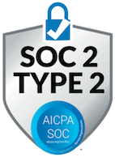
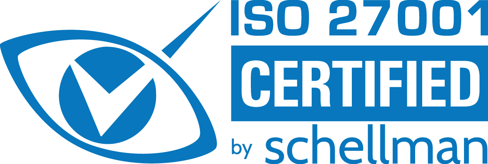

# How Snyk handles your data

Snyk은 데이터 보안에 가장 중요성을 두는 개발자 보안 플랫폼입니다. 개인 정보와 보안 요구 사항을 완전히 이해하고, Snyk는 이 문서를 통해 Snyk가 데이터에 액세스하고, 전송하며, 저장하는 방식에 대한 투명성을 제공합니다.

Snyk이 처리하는 데이터는 사용 중인 제품, Snyk와의 통합 방식 및 Snyk 배포에 따라 다양합니다. Snyk는 빠르게 변화함에 유의하십시오. 따라서, Snyk가 액세스하고 저장하는 데이터 유형은 새로운 기능 도입 또는 기존 기능에 대한 변경으로 변경될 수 있습니다.

## 유연한 배포 옵션

Snyk은 고객이 비즈니스에 가장 적합한 방식으로 Snyk 개발자 보안 플랫폼을 사용할 수 있도록 최신 소프트웨어 개발 관행과 기술을 활용합니다.

Snyk의 클라우드 중심 배포 옵션은 미국, EU 및 AU 지역에서 지원되는 멀티-테넌트 및 싱글-테넌트 옵션을 통해 사용의 용이성과 확장성을 제공하면서 필요한 수준의 데이터 보호를 제공합니다.

Snyk의 배포 옵션은 다음과 같습니다:

* **멀티 테넌트 SaaS**: Snyk의 개발자 보안 플랫폼을 사용하는 가장 간단하고 일반적이며 비용 효율적인 방법
* **싱글 테넌트 SaaS**: 프라이빗 클라우드 - Snyk의 개발자 보안 플랫폼의 격리되고 완전히 관리되는 인스턴스. 자세한 내용은 [Snyk 배포 옵션](https://snyk.io/platform/deployment-options/)을 참조하십시오.
* **Snyk 브로커**: Snyk의 개발자 보안 플랫폼 (멀티 테넌트 또는 싱글 테넌트)과 온프레미스 코드베이스 간의 프록시로 작동하는 프라이빗 인프라에 설치된 클라이언트 서비스. [Snyk 브로커](../enterprise-setup/snyk-broker/)는 데이터 전송 중에 데이터를 암호화하고 Snyk이 데이터에 액세스하는 방식을 엄격하게 제어합니다. 민감한 자격 증명은 방화벽 뒤에 유지됩니다.

## Snyk을 통한 고객 데이터 흐름

Snyk은 다양한 개발 도구와 통합 지점을 제공하며, 다양한 유형의 데이터가 필요하고 다른 데이터 상호 작용이 필요합니다. 다음 섹션에서는 Snyk이 액세스하고 저장하는 일반 데이터 유형과 제품 및 통합별 유형에 대한 개요를 제공합니다. 이 정보는 적어도 매년 두 번 또는 제품 작업에 중대한 변화가 발생할 때 검토됩니다.

## 일반 데이터 유형

* **취약점 데이터** - Snyk은 고객 응용 프로그램에서 식별된 취약점에 대한 정보를 저장합니다.
* **취약점 소스** - Snyk은 취약점이 확인된 위치에 대한 정보를 저장합니다. 예: 소스 코드 저장소 또는 레지스트리, 파일 이름 및 위치, 의존성 트리, 취약점 경로.
* **통합 관련 데이터** - Snyk은 Snyk과의 통합을 설정하는 데 필요한 정보를 저장합니다. 예: 토큰 및 API 구성.
* **사용자 데이터** - Snyk은 플랫폼에 액세스하고 사용하는 데 필요한 사용자 정보를 저장합니다. 예: 사용자 이름, ID(예: GitHub 사용자 ID), 이메일 주소, IP 주소.
* **사용자 목록** - 정확한 기여자 계수를 위해 Snyk은 모니터링되는 저장소에서 지난 90일 동안의 커밋에 액세스합니다. 요청 시 사용자 이메일의 비해시 버전이 생성됩니다.
* **청구 데이터** - Snyk은 Snyk 계정에 청구하기 위해 필요한 정보를 저장합니다.
* **사용자 행동 분석** - Snyk은 사용 패턴과 관련된 다양한 유형의 정보를 저장합니다. 예: 플랫폼 탐색 및 실행된 CLI 명령.


모든 데이터는 Snyk에서 SOC 2 표준에 따라 처리됩니다. 자세한 내용은 [Snyk 인증서](how-snyk-handles-your-data.md#snyk-certifications)를 참조하십시오.


### 취약점 소스 데이터와 관련된 캐시 유지 기간

Snyk은 취약점 소스 데이터를 처리하고 저장하기 위해 Amazon Web Services (AWS)와 Google Cloud Platform (GCP)의 클라우드 제품을 사용합니다. 이러한 데이터는 클라우드 서비스 제공 업체의 저장소 수명주기 정책에서 제공하는 가장 짧은 기간에 따라 캐시됩니다. 이는 해당 클라우드 서비스 제공 업체에 의해 변경될 수 있으며 대략 다음 기간에 해당됩니다:

* AWS 테넌트 - EU/AU/프라이빗 테넌트: [S3 정책](https://docs.aws.amazon.com/AmazonS3/latest/userguide/intro-lifecycle-rules.html)에 따라 24\~48시간
* GCP 테넌트 - 미국(기본값): [Google Cloud Storage 정책](https://cloud.google.com/storage/docs/lifecycle)에 따라 24시간

## 제품별 데이터 유형

Snyk은 데이터를 보호하는 것이 얼마나 중요한지 알고 있습니다. 따라서, Snyk는 각각의 Snyk 제품에 대해 설명된대로 정확한 분석을 제공하고 Snyk 서비스를 제공하기 위해 필요한 정보만 액세스하고 저장할 것입니다: Snyk Open Source, Snyk Code, Snyk Container, Snyk IaC.

### **Snyk** Open Source

<figure><figcaption>
Snyk Open Source
</figcaption></figure>

* Snyk은 오픈 소스 의존성을 식별하기 위해 매니페스트 파일, 락 파일 및 관련 구성 파일에 접근합니다.
* 다음 상황에서 Snyk는 소스 코드에 액세스합니다:
  * [SCM 통합을 위한 Workspaces](../scm-ide-and-ci-cd-integrations/snyk-scm-integrations/introduction-to-git-repository-integrations/workspaces-for-scm-integrations.md)가 활성화된 경우, Snyk은 [Git 레퍼런스](https://git-scm.com/book/en/v2/Git-Internals-Git-References)의 짧은 수명을 가진 미러 복사본을 가져와 오픈 소스 의존성을 식별하기 위해 매니페스트 파일, 락 파일 및 관련 구성 파일을 스캔합니다.
  * CLI 스캔이 `--unmanaged` 옵션을 사용하는 경우, Snyk는 소스 코드 파일에 액세스하여 파일 서명(해시)으로 변환하고 파일 서명과 파일 이름을 저장합니다.
* Snyk은 의존성의 이름과 버전 번호를 저장합니다.
* Snyk은 저작권 및 소유권 정보를 포함한 연관 라이선스의 이름을 저장합니다.
* Snyk은 저장소별 정보에 액세스하고 저장합니다.
* Snyk은 Git 공급자의 푸시 및 풀별 정보에 액세스하고 저장합니다. 예: 기여자 이름, 파일 이름, 타임스탬프.

**선택적 Snyk Open Source 애드온 (선택 참여)**

귀하의 계정은 이러한 기능을 활성화하는 데 제한하는 계약 조건에 따를 수 있습니다. 이러한 기능을 활성화함으로써, 귀하는 귀하의 회사를 대신하여 이러한 기능을 허용하기 위해 귀하의 계약 조건을 변경하도록 동의하며, 귀하는 귀하의 사정에 따라 이러한 기능의 사용에 책임을 질 것입니다.

* Go Modules 전체 소스 코드 분석 기능의 경우, Snyk은 정확한 종속성 그래프를 구축하기 위해 귀하의 Git 저장소 내용에 액세스하여 저장할 것입니다. Snyk 분석이 완료된 후에는 귀하의 코드가 Snyk 시스템에서 삭제됩니다.
* 개선된 .NET 스캔 기능의 경우, Snyk은 정확한 종속성 그래프를 구축하기 위해 귀하의 Git 저장소 내용에 액세스하여 저장할 것입니다. Snyk 분석이 완료된 후에는 귀하의 코드가 Snyk 시스템에서 삭제됩니다.
* Reachable 취약점 기능의 경우, Snyk은 콜 그래프를 구축하기 위해 귀하의 Git 저장소 내용에 액세스하여 저장할 것입니다. 분석이 완료된 후에는 귀하의 코드가 Snyk 시스템에서 삭제됩니다. 호출 그래프와 함수 이름만 유지됩니다.

### **Snyk** Code

<figure><figcaption>
Snyk Code
</figcaption></figure>

* Snyk은 저장소별 정보를 저장합니다. 예: Git 저장소의 이름 및 파일 이름. Snyk은 저장소 코드에 대한 일회성 분석을 위해 액세스하고 [소스 코드를 캐시](how-snyk-handles-your-data.md#how-snyk-processes-this-data)합니다. 이 기간 후, 발견된 문제의 위치(파일 경로, 라인, 열)와 문제 ID, 그리고 설명만 유지됩니다.귀하의 코드는 삭제되어 Snyk 네트워크 또는 로그에 저장되지 않습니다.
* 결과는 데이터베이스에 저장되며, Snyk에 의해 분석 및 모니터링 목적으로 사용됩니다.
* Snyk Code는 (1) 엔진 훈련 목적이나 (2) 잠재적인 수정 사항을 보여주기 위해 고객 코드를 사용하지 않습니다.
* Snyk Code Fix Suggestions를 위한 AI 모델은 퍼미시브 라이선스를 가진 공개 저장소에서 학습됩니다. 라이선스가 변경되는 저장소에서 가져온 데이터는 즉시 삭제됩니다. 데이터 수집 중에 정적 분석, 자동화 평가 및 일부 인간 레이블링이 사용됩니다.
* 스캔 결과에는 원래 소스 코드가 아닌 위치 지정 포인터가 포함됩니다. 예: 파일, 라인 및 열 번호 등, 식별 메타 정보가 있어 해당 소스 코드 버전을 사용하여 결과가 표시됩니다.
* Snyk은 저장소별 정보를 저장합니다. 예: Git 저장소의 이름과 파일 이름.
* 서버 인프라는 인증 및 권한 부여를 통해 고객 간 분리를 보장하기 위해 작동합니다. Snyk Code는 소프트웨어 제어를 사용하여 고객 데이터 분리를 보장합니다. 모든 통신은 고급 산업 표준 프로토콜을 사용하여 암호화됩니다.

### **Snyk** Container

<figure><figcaption>
Snyk Container
</figcaption></figure>

* Snyk은 패키지 버전, 실행 가능한 해시 및 버전, 운영 체제, 컨테이너 이미지 메타데이터(예: 루트 FS 해시, 히스토리) 및 이미지 ID에 액세스하고 저장합니다.
* Snyk은 부모 이미지에 대한 정보를 액세스하고 저장합니다: 이름, 버전 및 태그.
* Snyk은 Dockerfile의 RUN 지시문에 액세스하고 저장합니다.
* Kubernetes 구성: Snyk은 워크로드 보안 설정, 예를 들어 `루트로 실행`를 액세스합니다. 이는 Snyk Kubernetes 통합을 사용하는 경우에만 액세스됩니다.
* 컨테이너 레지스트리 통합: Snyk은 컨테이너 이미지의 단기 복사본에 액세스한 후 분석 후 Snyk 네트워크에서 삭제합니다. 브로커가 사용되지 않는 한 이 복사본이 Snyk에서 제거됩니다.

### **Snyk IaC**

<figure><figcaption>
Snyk Infrastructure as Code
</figcaption></figure>

#### Current IaC

* CLI 테스트는 로컬에서 수행됩니다. 결과를 `--report` 옵션을 사용하여 Snyk 플랫폼에 공유하면 리소스 구성도 포함됩니다.
* SCM 테스트는 인프라 코드 파일에 대한 접근 권한이 필요합니다. Snyk는 분석 기간 동안만 해당 파일을 저장하고, 분석 완료 후 Snyk 시스템에서 삭제합니다. 문제와 리소스에 대한 컨텍스트를 제공하기 위해 분석된 리소스 구성은 유지됩니다.
* Terraform Cloud 및 Terraform Enterprise 테스트는 계획 파일(plan files)을 분석합니다. Snyk은 비밀 정보와 민감한 값을 제거하고, 문제와 리소스에 대한 컨텍스트를 제공하기 위해 리소스 구성을 유지합니다.
* `snyk iac describe`를 사용한 드리프트 감지에서는 최소 권한 원칙에 따라 Snyk은 [AWS](../scan-with-snyk/snyk-iac/iac+-code-to-cloud-capabilities/detect-drift-and-manually-created-resources/configure-cloud-providers/configure-aws-provider.md#least-privileged-policy), [Azure](../scan-with-snyk/snyk-iac/iac+-code-to-cloud-capabilities/detect-drift-and-manually-created-resources/configure-cloud-providers/configure-azure-provider.md#least-privileged-policy), [Google](../scan-with-snyk/snyk-iac/iac+-code-to-cloud-capabilities/detect-drift-and-manually-created-resources/configure-cloud-providers/configure-google-provider.md#least-privileged-policy), 또는 [GitHub](../scan-with-snyk/snyk-iac/iac+-code-to-cloud-capabilities/detect-drift-and-manually-created-resources/configure-cloud-providers/configure-github-provider.md#least-privileged-policy)의 읽기 전용 접근만 필요합니다. 공급자 자격 증명은 Snyk에 전송되거나 저장되지 않습니다.
* Snyk은 로컬 읽기 전용 Terraform 상태 파일 접근을 기반으로 하며, 관련 리소스 구성 데이터를 플랫폼으로 전송 및 추출합니다.

#### IaC+

* Snyk Cloud는 클라우드 플랫폼 API를 스캔하여 AWS 계정과 Google Cloud 구독에 배포된 구성된 인프라에 대한 정보를 수집합니다.
* 스캔을 수행하기 위해 Snyk은 각 클라우드 플랫폼에서 지원하는 다양한 인증 메커니즘을 활용하며, 최소 권한 원칙을 따릅니다.
  * Amazon Web Services(AWS)의 경우, 읽기 전용 AWS IAM 역할을 AWS 계정에 프로비저닝해야 필수 AWS API에 대한 안전한 접근을 제공합니다.
  * Google Cloud의 경우, 읽기 전용 Google Cloud 서비스 계정을 프로비저닝하여 필수 Google Cloud API에 대한 안전한 접근을 제공합니다.
* 스캔 중 Snyk은 리소스 구성 상태를 수집 및 저장하여 분석을 수행하며, 잘못된 구성으로 인해 발생한 문제의 세부 정보를 저장합니다.
* Snyk Cloud는 문제와 리소스에 대한 컨텍스트를 제공하기 위해 스캔에서 발견된 리소스 구성 상태를 유지하지만, 비밀 정보나 민감한 값은 저장하지 않습니다.

### Snyk AppRisk

<figure><figcaption>
Snyk AppRisk
</figcaption></figure>

* Snyk AppRisk는 Snyk 그룹 수준에서 데이터를 가시화하며, 해당 그룹 내 모든 Snyk 조직의 범위를 포함합니다.
* 관련 Snyk 조직 내 Snyk 대상 및 프로젝트에서 Snyk AppRisk는 코드 저장소 자산, 패키지(1차) 자산, 컨테이너 이미지 자산을 생성하기 위해 자산 메타데이터에 접근하고 이를 저장합니다. 자산 메타데이터에는 Git 원격 URL, 저장소에 포함된 언어, 커밋 이력 메타데이터(소스 코드 제외)가 포함됩니다.
* Snyk AppRisk 통합 허브를 통해 구성된 SCM 통합에서 Snyk AppRisk는 다음 데이터를 접근 및 저장합니다:
  * 모니터링 중인 저장소의 최근 50개 커밋의 커밋 이력 메타데이터(예: GitHub 사용자 ID, 표시 이름, 이메일 등).
  * 코드 저장소에 사용된 언어(예: Python, HTML 등)의 메타데이터.
  * 저장소 “토픽”으로 표시되는 자산 태그.
* 관측 가능성, CNAPP 등과 같은 런타임 데이터 소스를 구성한 경우, Snyk AppRisk는 다음 데이터를 접근 및 저장할 수 있습니다:
  * 다양한 클러스터에서 존재하는 Kubernetes 리소스(예: 배포, 파드 등).
  * 런타임에 사용되는 애플리케이션 엔티티와 실행 방식(예: 메모리에 로드됨).
  * OS 자체의 파일 메타데이터.
  * 런타임 및 클라우드 환경 정보.
  * 클러스터를 통해 흐르는 HTTP 요청 메타데이터(예: 호스트 이름, 경로 등).

## Snyk integrations: Workspaces


작업 공간 활성화 및 사용에 대한 자세한 내용은 [작업 공간 및 SCM 통합](../scm-ide-and-ci-cd-integrations/snyk-scm-integrations/introduction-to-git-repository-integrations/workspaces-for-scm-integrations.md)을 참조하세요.


Snyk은 데이터를 안전하게 유지하기 위해 다음과 같은 보호 장치를 제공합니다:

* Snyk은 SCM 통합 플로우가 필요한 경우(예: PR 확인, 가져오기, 테스트)만 클론 작업을 수행합니다.
* 클론 서비스와 캐시 간 통신은 TLS로 암호화됩니다.
* 클론된 자산은 캐시를 채운 직후 파일 시스템에서 삭제됩니다.
* 모든 데이터는 Snyk의 SOC 2 표준에 따라 처리됩니다. 자세한 내용은 [Snyk 인증](how-snyk-handles-your-data.md#snyk-certifications)을 참조하세요.
* 귀하의 데이터는 코드 보안 및 품질 향상을 목적으로만 분석되며, 데이터 처리 부록에 따라 처리됩니다.

## Snyk 인증

<figure><figcaption>
Soc 2 Type 2 AICPA Soc
</figcaption></figure>

Snyk은 ISO 27001:2022 인증을 받았으며, ISO 27017:2015의 추가 목적 통제를 포함합니다.

<figure><figcaption>
ISO 27001 Schellman certification
</figcaption></figure>

## **Snyk의 GDPR 준수 유지 방법**

Snyk은 개인정보를 중요하게 생각하며 GDPR, CCPA 및 기타 관련 개인정보 보호법의 요구 사항을 충족하기 위해 글로벌 개인정보 보호 프로그램을 운영합니다. Snyk은 모든 사용자 데이터를 동일하게 처리하며, 저장된 정보를 보호하기 위해 업계 표준 기술 및 조직적 조치를 사용합니다. Snyk 개인정보 보호 프로그램은 법적 요구 사항과 사용자의 요구를 모두 충족하도록 설계되었습니다.

더 알아보기: [Snyk 개인정보 보호 정책](https://snyk.io/policies/privacy/).

## Snyk 정책

자세한 내용은 Snyk 웹사이트의 다음 페이지를 참조하세요:

* [개인정보 보호](https://snyk.io/policies/privacy/)
* [Snyk 하위 처리](https://snyk.io/policies/subprocessors/)
* [데이터 처리 부록](https://snyk.io/policies/dpa/)
* [추적 및 분석](https://snyk.io/policies/tracking-and-analytics/)